# 📊 EXECUTIVE AUDIT REPORT: PAKET B — B2B DIGITAL HUB PLATFORM

**Client:** PT. Alfa Beauty Cosmetica  
**Audit Date:** January 11, 2026  
**Auditor Perspective:** CEO/CIO Strategic Review  
**Document Version:** 1.0  
**References:**
- [Blueprint V3.4](file:///c:/Users/VCTUS/Documents/Projects/AlfaBeauty/Document%20Pra%20Eksekusi/docs-paket-b/blueprint.md)
- [FSD-IDD V2.6](file:///c:/Users/VCTUS/Documents/Projects/AlfaBeauty/Document%20Pra%20Eksekusi/docs-paket-b/fsd-idd.md)
- [Database ERD V2.0](file:///c:/Users/VCTUS/Documents/Projects/AlfaBeauty/Document%20Pra%20Eksekusi/docs-paket-b/database_erd.md)
- [DevOps V2.4](file:///c:/Users/VCTUS/Documents/Projects/AlfaBeauty/Document%20Pra%20Eksekusi/docs-paket-b/devops.md)
- [SoW V2.5](file:///c:/Users/VCTUS/Documents/Projects/AlfaBeauty/Document%20Pra%20Eksekusi/docs-paket-b/sow.md)
- [WBS V2.5](file:///c:/Users/VCTUS/Documents/Projects/AlfaBeauty/Document%20Pra%20Eksekusi/docs-paket-b/wbs.md)
- [UAT V2.0](file:///c:/Users/VCTUS/Documents/Projects/AlfaBeauty/Document%20Pra%20Eksekusi/docs-paket-b/uat.md)

---

## 1. EXECUTIVE SUMMARY

### Assessment: ✅ **DOCUMENTATION COMPLETE — READY FOR EXECUTION**

| Aspek | Status | Score |
|-------|--------|-------|
| Documentation Completeness | ✅ Complete | 10/10 |
| Architecture Clarity | ✅ Clear | 10/10 |
| Scope Definition | ✅ Clear | 10/10 |
| UAT Coverage | ✅ Complete | 33 scenarios |
| Risk Identification | ✅ Identified | Medium-High |
| Budget Clarity | ✅ Clear | Rp 23.5M |
| Implementation Readiness | ✅ Ready | Phase 1 |

### Strategic Vision
> **"Invisible Governance, Frictionless Commerce"**

Sistem Hybrid Governance yang menjaga disiplin keuangan (Credit Logic), melindungi rantai pasok (SLA Routing), dan meningkatkan retensi mitra (Loyalty Engine) — sambil tetap menghormati budaya hubungan personal B2B yang sudah berjalan 15 tahun.

### Scale Profile

| Parameter | Value | Validation |
|-----------|-------|------------|
| **SKU Count** | 500 - 2.000 | Small Data (< 10MB in-memory) |
| **Active Partners** | 5.000 - 10.000 | Stable B2B base |
| **Daily Transactions** | 500 - 1.000 | ~1.6 tx/menit (Low Throughput) |
| **Read:Write Ratio** | 20:1 | Read Heavy |

**Implikasi Teknis:** Tantangan bukan pada *concurrency*, melainkan pada **reliabilitas transaksi**, **konsistensi data**, dan **latency**.

---

## 2. SCOPE DEFINITION

### ✅ In-Scope (Paket B)

| Module | Description |
|--------|-------------|
| **Identity & Access** | Multi-role RBAC + Agent Impersonation |
| **Commercial Governance** | Credit Limit Heuristics + Tier Pricing |
| **Loyalty Engine** | Point Multiplier + Fixed Redemption |
| **Supply Chain Middleware** | SLA Routing + Inventory Buffer |
| **Partner Profiling** | Salon data collection for segmentation |
| **Invoice & Payment** | Payment tracking + Point trigger |
| **SLA Escalation** | 18h reminder + 24h escalation |
| **Admin Configuration** | Agile config panel (no redeploy) |
| **Public Catalog** | Headless + Retail Deflection |
| **Partner Dashboard** | Inquiry Builder + Credit Status |
| **Agent Assist** | Shadow Mode for Salesman |
| **Admin SLA Dashboard** | Order monitoring + Escalation view |
| **Cloud Infrastructure** | Terraform IaC (GCP/AWS) |
| **CI/CD Pipeline** | GitOps + Quality Gates |

### ❌ Out-of-Scope

| Item | Notes |
|------|-------|
| **ERP Bug Fixing** | Integration only, not fixing legacy ERP |
| **Content Creation** | Photography, SEO articles, videos |
| **Physical Warehouse** | No barcode scanning, stock opname |
| **Third-party Costs** | GCP/AWS, Redis Cloud, Domain |
| **WhatsApp API Fees** | Using Deep Link (free), not WABA |

---

## 3. ARSITEKTUR LENGKAP

### 3.1 System Architecture Overview

```mermaid
graph TB
    subgraph "PUBLIC ZONE"
        GUEST[👤 Guest]
        CATALOG[📦 Public Catalog<br/>No Price]
        SHOPEE[🛒 Shopee Deep Link<br/>Retail Deflection]
    end

    subgraph "PRIVATE ZONE - PARTNER"
        PARTNER[👤 Partner/Salon]
        DASHBOARD[📊 Partner Dashboard]
        INQUIRY[🛒 Inquiry Builder]
        CREDIT[💳 Credit Status]
        INVOICE[📄 Invoice Status]
        POINTS[⭐ Point Balance]
    end

    subgraph "PRIVATE ZONE - AGENT"
        AGENT[👔 Salesman/Agent]
        SHADOW[👥 Shadow Mode<br/>Impersonation]
        ASSIST[🤝 Agent Assist]
    end

    subgraph "ADMIN ZONE"
        ADMIN[🛡️ Admin]
        SLA_DASH[📈 SLA Dashboard]
        CONFIG[⚙️ Config Panel]
        MONITOR[👁️ Order Monitor]
    end

    subgraph "INTEGRATION LAYER"
        WA[💬 WhatsApp Deep Link]
        ERP_ACL[🔌 ERP ACL Adapter<br/>Circuit Breaker]
        SUBDIST[🏢 Sub-Distributor<br/>WA Routing]
    end

    subgraph "CORE BACKEND"
        AUTH[🔐 Auth & RBAC]
        COMMERCIAL[💰 Commercial Engine<br/>Credit + Pricing]
        LOYALTY[⭐ Loyalty Engine<br/>Points + Redemption]
        ROUTING[🗺️ SLA Routing]
        INVOICE_MOD[📄 Invoice Module]
    end

    subgraph "DATA LAYER"
        REDIS[(⚡ Redis Cache<br/>Catalog + Config)]
        POSTGRES[(🐘 PostgreSQL<br/>Managed DB)]
    end

    %% Guest Flow
    GUEST --> CATALOG
    CATALOG --> SHOPEE

    %% Partner Flow
    PARTNER --> DASHBOARD
    DASHBOARD --> INQUIRY
    DASHBOARD --> CREDIT
    DASHBOARD --> INVOICE
    DASHBOARD --> POINTS
    INQUIRY --> WA

    %% Agent Flow
    AGENT --> SHADOW
    SHADOW --> ASSIST
    ASSIST --> INQUIRY

    %% Admin Flow
    ADMIN --> SLA_DASH
    ADMIN --> CONFIG
    ADMIN --> MONITOR

    %% Backend Connections
    INQUIRY --> COMMERCIAL
    COMMERCIAL --> AUTH
    COMMERCIAL --> LOYALTY
    COMMERCIAL --> ERP_ACL
    ROUTING --> SUBDIST
    ROUTING --> WA

    %% Data Layer
    COMMERCIAL --> REDIS
    COMMERCIAL --> POSTGRES
    LOYALTY --> POSTGRES
    CONFIG --> REDIS

    %% Styling
    classDef public fill:#e3f2fd,stroke:#1976d2
    classDef partner fill:#e8f5e9,stroke:#388e3c
    classDef agent fill:#fff3e0,stroke:#f57c00
    classDef admin fill:#fce4ec,stroke:#c2185b
    classDef backend fill:#f3e5f5,stroke:#7b1fa2
    classDef data fill:#efebe9,stroke:#5d4037
```



### 3.2 Domain-Driven Module Architecture

```mermaid
graph TD
    subgraph "CORE DOMAIN: Commercial"
        PE[💰 Pricing Engine<br/>Tier-based Pricing]
        CL[💳 Credit Limit Rules<br/>Heuristics]
    end

    subgraph "SUPPORTING DOMAIN: Supply Chain"
        INV[📦 Inventory & Buffer<br/>Safety Stock]
        RT[🗺️ SLA Routing Logic<br/>Geo-based]
    end

    subgraph "GENERIC SUBDOMAIN: Identity"
        AUTH[🔐 Auth & RBAC<br/>JWT + Roles]
        IMP[👥 Agent Masquerade<br/>Impersonation]
    end

    subgraph "SUPPORTING DOMAIN: Loyalty"
        PTS[⭐ Point Calculator<br/>Multiplier]
        RED[🎁 Redemption Catalog]
    end

    subgraph "ANTI-CORRUPTION LAYER"
        ERP[🔌 ERP Adapter<br/>Circuit Breaker]
    end

    %% Dependencies
    PE --> AUTH
    CL --> ERP
    INV --> ERP
    RT --> AUTH
    PTS --> CL

    %% Styling
    style ERP fill:#f9f,stroke:#333,stroke-width:2px,stroke-dasharray: 5 5
```



### 3.3 Database ERD (High-Level)


### 3.4 Order & Invoice Flow

```mermaid
sequenceDiagram
    participant P as Partner
    participant F as Frontend
    participant BE as Backend
    participant CR as Credit Check
    participant RT as Routing
    participant SD as Sub-Distributor
    participant WA as WhatsApp
    participant INV as Invoice Module
    participant LY as Loyalty Engine

    P->>F: Add items to Inquiry
    F->>BE: Check Credit Status
    BE->>CR: GET /api/credit/status
    
    alt Credit OK (GREEN)
        CR-->>BE: status: GREEN
        BE-->>F: Show "Kirim Order" button
    else Over Limit (AMBER)
        CR-->>BE: status: AMBER, gap: -2.5M
        BE-->>F: Show "Ajukan Approval" button
    end

    P->>F: Submit Order
    F->>BE: POST /api/orders
    BE->>RT: Route to Sub-Distributor
    RT->>RT: Lookup region → SubDist
    RT-->>BE: WhatsApp Deep Link

    BE-->>F: Order Created + WA Link
    F->>WA: Open wa.me/{subdist}?text={order}
    WA->>SD: Order Message

    Note over SD: Manual processing via WhatsApp

    SD->>BE: Update status: APPROVED
    BE->>INV: Create Invoice
    INV->>INV: Calculate due_date from Tier

    Note over P: Partner pays invoice

    BE->>INV: Record Payment
    INV->>INV: Status → PAID
    INV->>LY: Trigger Point Credit
    LY->>LY: Calculate: amount * multiplier
    LY-->>P: Points credited!
```



### 3.5 SLA Escalation Flow

```mermaid
graph LR
    subgraph "T+0: Order Submitted"
        A[📤 Order Submitted]
        B[🏢 Routed to SubDist]
    end

    subgraph "T+18h: Reminder"
        C[⏰ No Response]
        D[📧 Send Reminder<br/>to SubDist Manager]
    end

    subgraph "T+24h: Escalation"
        E[⏰ Still No Response]
        F[🚨 Notify HQ Admin<br/>Intervention Required]
    end

    subgraph "Resolution"
        G[✅ Admin takes action]
        H[📋 Log to SLA_ESCALATION_LOGS]
    end

    A --> B
    B --> C
    C --> D
    D --> E
    E --> F
    F --> G
    G --> H

    style F fill:#ffcdd2,stroke:#c62828
    style G fill:#c8e6c9,stroke:#2e7d32
```



### 3.6 Technology Stack


### 3.7 Infrastructure Layer


---

## 4. ACTOR ROLES & RBAC

| Role | System Enum | Access Scope | Auth Method |
|------|-------------|--------------|-------------|
| **Guest** | - | Read-only Catalog | None |
| **Partner** | `PARTNER` | Inquiry Builder, Credit Module | Email/Password |
| **Agent** | `AGENT` | Impersonate Partner, Sales Attribution | Email/Password |
| **Admin** | `ADMIN` | Full SLA Dashboard, Config Management | Email/Password |
| **Sub-Distributor** | - | Receive orders via WhatsApp | **No Login** |

### Tier System

| Marketing Name | System Enum | Payment Term | Multiplier |
|----------------|-------------|--------------|------------|
| New Partner | `TIER_SILVER` | CBD (Cash Before Delivery) | 1.0x |
| Verified Partner | `TIER_GOLD` | TOP-14 (Net 14 Days) | 1.2x |
| Priority Partner | `TIER_PLATINUM` | TOP-30 (Net 30 Days) | 1.5x |

---

## 5. CORE MODULES DETAIL

### 5.1 Credit Governance

| State | Condition | UI Behavior |
|-------|-----------|-------------|
| **GREEN** | Gap ≥ 0 | "Kirim Order" button active |
| **AMBER** | Gap < 0 or System Error | "Ajukan Approval" button |

**Visual for Admin:**
```
[PERINGATAN SISTEM: KREDIT MELEBIHI LIMIT | SELISIH: Rp -2.500.000]
```

### 5.2 Inventory Buffer

| SKU Type | Definition | Buffer Formula |
|----------|------------|----------------|
| Fast Moving | > 50 tx/month | CEILING(Avg Daily Sales × 3) |
| Slow Moving | < 10 tx/month | Fixed 2 Units |

### 5.3 Loyalty Engine

| Formula | Description |
|---------|-------------|
| `Base Points` | Grand Total / Rp 10.000 |
| `Earned Points` | Base × Tier Multiplier |
| `Eligibility` | Only if Order ≥ Rp 500.000 |
| `Credit Trigger` | Only when Invoice = PAID |

### 5.4 Agile Configuration

| Config Key | Default | Purpose |
|------------|---------|---------|
| `loyalty.multiplier.silver` | 1.00 | Point multiplier |
| `loyalty.multiplier.gold` | 1.20 | Point multiplier |
| `loyalty.multiplier.platinum` | 1.50 | Point multiplier |
| `order.minimum_threshold` | 500.000 | Min order for points |
| `stock.sync_interval_minutes` | 15 | ERP sync interval |
| `sla.reminder_hours` | 18 | Reminder to SubDist |
| `sla.escalation_hours` | 24 | Escalation to HQ |

---

## 6. DATABASE ARCHITECTURE

### 6.1 Tables Summary (18 Tables)

| Domain | Tables |
|--------|--------|
| **Identity** | PARTNERS, AGENTS, REGIONS, SUB_DISTRIBUTORS |
| **Catalog** | PRODUCTS, BRANDS, CATEGORIES, TIER_PRICES, INVENTORY |
| **Commercial** | ORDERS, ORDER_ITEMS, INVOICES, INVOICE_PAYMENTS |
| **Loyalty** | POINT_TRANSACTIONS, REDEMPTIONS, REDEMPTION_CATALOG |
| **Configuration** | SYSTEM_CONFIGS |
| **Audit** | AUDIT_LOGS, AGENT_SESSIONS, IMPERSONATION_NOTIFICATIONS, SLA_ESCALATION_LOGS |

### 6.2 Key Design Decisions

| Decision | Rationale |
|----------|-----------|
| **UUID Primary Keys** | Distributed system readiness |
| **DECIMAL for Money** | Precision (not FLOAT) |
| **Soft Delete** | Audit trail preservation |
| **Timestamp with TZ** | Multi-region support |
| **JSONB for Audit** | Flexible old/new value storage |
| **Row-Level Security** | Partner can only see own data |

---

## 7. SLIs & SLOs

### 7.1 Availability

| Metric | SLI | SLO |
|--------|-----|-----|
| **API Uptime** | Successful / Total | **99.9%** monthly |
| **Error Rate** | 5xx / Total | **< 0.1%** monthly |

### 7.2 Latency

| Endpoint | P50 | P95 | P99 |
|----------|-----|-----|-----|
| Health Check | < 5ms | < 20ms | < 50ms |
| Auth/Login | < 100ms | < 300ms | < 500ms |
| Credit Check | < 50ms | < 150ms | < 300ms |
| Product List | < 100ms | < 300ms | < 500ms |
| Order Submit | < 200ms | < 500ms | < 1s |

### 7.3 Business SLIs

| Metric | Target |
|--------|--------|
| Credit Check Accuracy | 100% |
| Order Success Rate | > 95% |
| WA Routing Success | > 99% |

### 7.4 Error Budget

| SLO | Allowed Downtime |
|-----|------------------|
| 99.9% | 43.2 min/month |
| 99.95% | 21.6 min/month |
| 99.99% | 4.32 min/month |

### 7.5 Alerting

| Level | Condition | Response |
|-------|-----------|----------|
| **Critical** | Error > 1% for 5 min | Page immediately |
| **Warning** | Error > 0.5% for 10 min | Slack notification |

---

## 8. UAT SCENARIOS (33 Test Cases)

| Category | Count | Priority |
|----------|-------|----------|
| Identity & Access | 5 | P0 |
| Commercial (Credit) | 4 | P0 |
| Routing & SLA | 6 | P0 |
| Invoice & Payment | 4 | P0 |
| Loyalty | 7 | P0 |
| Resilience | 2 | P1 |
| Config & Profile | 4 | P1 |
| Multi-Language | 1 | P2 |
| **TOTAL** | **33** | |

### Key Test Cases

| ID | Scenario | Expected |
|----|----------|----------|
| UAT-03C | Impersonation Checkout | Owner gets WA/Email notification |
| UAT-20 | Geo-Routing | Order → correct SubDist region |
| UAT-24 | SLA Escalation 24h | HQ Admin notified + log |
| UAT-42 | Point Credit on PAID | Balance updated + EARNED record |

---

## 9. WORK BREAKDOWN STRUCTURE

### 9.1 Epic Summary

| Epic | Focus | Man-Days |
|------|-------|----------|
| EPIC 1 | Infrastructure & DevOps | 14 MD |
| EPIC 2 | Backend Core Services | 60.5 MD |
| EPIC 3 | Frontend Experience | 42.5 MD |
| EPIC 4 | QA & UAT | 21 MD |
| EPIC 5 | Agile Config & Profiling | 6 MD |
| **TOTAL** | | **161.5 MD** |

### 9.2 Resource Allocation

| Discipline | Man-Days |
|------------|----------|
| DevOps | 12.5 MD |
| Backend | 62.25 MD |
| Frontend | 39.75 MD |
| QA/Tester | 21 MD |
| PM/Architect | 20 MD |
| Partner Profiling | 6 MD |

### 9.3 Timeline

| Phase | Duration | Deliverable |
|-------|----------|-------------|
| Phase 1 | Week 1-2 | Cloud Setup, ERP POC |
| Phase 2 | Week 3-7 | API, Credit, Pricing, Invoice, SLA |
| Phase 3 | Week 6-11 | UI, Agent Mode, Catalog |
| Phase 4 | Week 12-16 | Security, UAT, Go-Live |

**Key Dates:**
- Kick-off: January 2026
- Go-Live: May 2026
- Warranty End: June 2026

---

## 10. FINANCIAL SUMMARY

### 10.1 Development Cost

| Component | Man-Days | Rate | Total |
|-----------|----------|------|-------|
| Backend | 62.25 | Rp 135.000 | Rp 8.403.750 |
| Frontend | 39.75 | Rp 135.000 | Rp 5.366.250 |
| DevOps | 12.5 | Rp 135.000 | Rp 1.687.500 |
| QA | 21 | Rp 135.000 | Rp 2.835.000 |
| PM/Arch | 20 | Rp 135.000 | Rp 2.700.000 |
| Profiling | 6 | Rp 135.000 | Rp 810.000 |
| **TOTAL** | **161.5 MD** | | **Rp 23.500.000** |

### 10.2 Payment Terms

| Termin | Milestone | % | Amount |
|--------|-----------|---|--------|
| DP | SoW Signing | 30% | Rp 7.050.000 |
| M1 | Backend Complete | 30% | Rp 7.050.000 |
| M2 | Frontend + UAT Ready | 30% | Rp 7.050.000 |
| Retention | Go-Live + 30 days | 10% | Rp 2.350.000 |

### 10.3 CR Rate Card

| Type | Rate |
|------|------|
| Engineering | Rp 35.000/jam |
| Consultant/Architect | Rp 50.000/jam |

### 10.4 Maintenance (Post-Warranty)

| Scope | Cost |
|-------|------|
| Monthly Retainer | Rp 1.000.000/bulan |
| 6 Months (Jul-Dec) | Rp 6.000.000 |

### 10.5 Total Contract Value

| Item | Amount |
|------|--------|
| Development | Rp 23.500.000 |
| Warranty (30 days) | Rp 0 |
| Maintenance (6 mo) | Rp 6.000.000 |
| **GRAND TOTAL** | **Rp 29.500.000** |

---

## 11. RISK ASSESSMENT

| Risk | Probability | Impact | Mitigation |
|------|-------------|--------|------------|
| ERP Access Delay | Medium | High | 3 MD buffer |
| ERP Stability | Medium | High | Circuit Breaker + Degraded Mode |
| WhatsApp Link Issues | Low | Medium | Copy-Paste fallback |
| Cold Start Latency | Medium | Medium | min-instances=1 + Warm-up Pinger |
| Invoice Complexity | Low | High | Thorough partial payment tests |
| SLA Timing Edge | Medium | Medium | ±5 min tolerance |
| User Adoption | Medium | Medium | Agent Assist Mode |

---

## 12. GOVERNANCE & INCIDENT RESPONSE

### 12.1 Severity Matrix

| Level | Definition | Response SLA | Escalation |
|-------|------------|--------------|------------|
| SEV-1 | Business stopped | < 15 min | CTO, CIO, VP Sales |
| SEV-2 | Major degradation | < 1 hour | Eng Lead, Ops |
| SEV-3 | Minor issue | < 24 hours | Support |
| SEV-4 | Request | < 48 hours | Helpdesk |

### 12.2 BCP Targets

| Metric | Target |
|--------|--------|
| RPO | 1 hour |
| RTO | 4 hours |

### 12.3 Manual Fallback

- PDF Catalog + Excel Pricing
- Manual nota → Photo → Send to Admin

---

## 13. CLIENT DEPENDENCIES

| Dependency | Deadline | Impact if Delayed |
|------------|----------|-------------------|
| ERP API Documentation | Week 1 | Critical Path shift |
| Sub-Distributor WA List | Week 2 | Routing disabled |
| Product Data (SKU/Photos) | Week 2 | Catalog incomplete |
| Credit Limit Data | Week 3 | Default limits only |

---

## 14. RECOMMENDATIONS

### For CEO
1. ✅ Documentation enterprise-grade — audit-ready
2. ✅ Rate Rp 135.000 = 80-85% savings vs agency
3. ⚠️ **Critical Path:** ERP Integration
4. 📋 **Action:** Sign SoW, prepare IT team

### For CIO
1. ✅ Architecture decision solid (Modular Monolith)
2. ✅ Resilience patterns defined (Circuit Breaker, Degraded Mode)
3. ⚠️ **Monitor:** Cold Start mitigation (min-instances)
4. 📋 **Action:** Prepare ERP API access Week 1

### For Development Team
1. ✅ Clean Architecture scaffold ready
2. ✅ 5 Epics with detailed task breakdown
3. 📋 **Next:** Execute Phase 1 (Infra + ERP POC)

---

## 15. SIGN-OFF STATUS

| Item | Status | Evidence |
|------|--------|----------|
| Blueprint Approval | ⏳ PENDING | _Link required_ |
| SoW Approval | ⏳ PENDING | _Link required_ |
| UAT Approval | ⏳ PENDING | _After execution_ |

---

**Prepared by:** AI Audit System  
**Document Status:** Ready for Executive Sign-off
