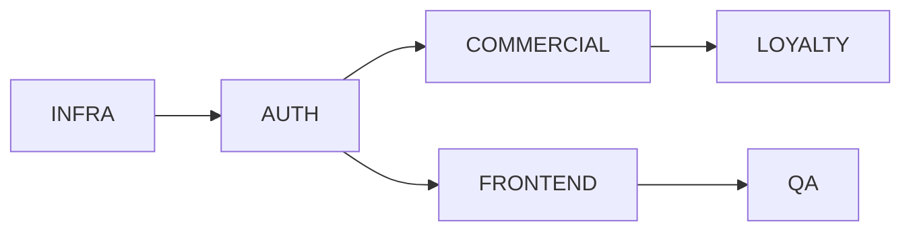

# MODUL PANDUAN DOKUMENTASI PROYEK SOFTWARE
## Panduan Komprehensif Membuat Dokumentasi dari Nol

**Tujuan:** Modul ini adalah panduan praktis untuk membuat **10 jenis dokumen pra-eksekusi** proyek software, berdasarkan best practices industri dan studi kasus nyata.

**Target Pembaca:** Project Manager, Software Architect, Business Analyst, Technical Writer, Developer Lead

---

# DAFTAR ISI

1. [Pendahuluan & Metodologi](#bagian-1-pendahuluan--metodologi)
2. [Blueprint - Arsitektur Bisnis](#bagian-2-blueprint---arsitektur-bisnis)
3. [Database ERD - Desain Data](#bagian-3-database-erd---desain-data)
4. [DevOps - Infrastruktur & Deployment](#bagian-4-devops---infrastruktur--deployment)
5. [FSD-IDD - Spesifikasi Fungsional](#bagian-5-fsd-idd---spesifikasi-fungsional)
6. [Governance - Prosedur Operasional](#bagian-6-governance---prosedur-operasional)
7. [RAB Infrastruktur - Anggaran Cloud](#bagian-7-rab-infrastruktur---anggaran-cloud)
8. [Statement of Work - Kontrak Kerja](#bagian-8-statement-of-work---kontrak-kerja)
9. [UAT - Skenario Pengujian](#bagian-9-uat---skenario-pengujian)
10. [WBS - Work Breakdown Structure](#bagian-10-wbs---work-breakdown-structure)
11. [Validation Report - Audit Kesiapan](#bagian-11-validation-report---audit-kesiapan)
12. [Urutan Pembuatan & Dependencies](#bagian-12-urutan-pembuatan--dependencies)
13. [Template & Checklist](#bagian-13-template--checklist)

---

# BAGIAN 1: PENDAHULUAN & METODOLOGI

## 1.1 Mengapa Dokumentasi Penting?

Berdasarkan riset industri:
- **70% proyek gagal** karena requirements tidak jelas (Standish Group)
- **Dokumentasi yang baik** mengurangi waktu onboarding developer 50% (IBM)
- **Estimasi yang akurat** hanya mungkin dengan scope yang terdefinisi (PMI)

## 1.2 Prinsip Dokumentasi Efektif

| Prinsip | Penjelasan |
|---------|------------|
| **Clarity over Completeness** | Lebih baik jelas & ringkas daripada panjang tapi membingungkan |
| **Single Source of Truth** | Satu dokumen untuk satu topik, hindari duplikasi |
| **Version Control** | Selalu cantumkan versi dan tanggal update |
| **Audience-Aware** | Sesuaikan bahasa dengan pembaca (teknis vs bisnis) |
| **Actionable** | Dokumen harus bisa ditindaklanjuti, bukan hanya dibaca |

## 1.3 Standar Industri yang Digunakan

| Standar | Digunakan Untuk |
|---------|-----------------|
| **IEEE 830** | Software Requirements Specification |
| **RFC 7807** | Problem Details for HTTP APIs |
| **TOGAF** | Enterprise Architecture |
| **PMBOK** | Project Management (WBS, SoW) |
| **ITIL** | IT Service Management (SLA, Incident) |
| **ISO 27001** | Information Security |

## 1.4 Tools yang Direkomendasikan

| Kategori | Tools |
|----------|-------|
| **Penulisan** | Markdown (VS Code, Obsidian), Notion, Confluence |
| **Diagram** | Mermaid, Draw.io, Lucidchart, Excalidraw |
| **ERD** | dbdiagram.io, MySQL Workbench, pgModeler |
| **Version Control** | Git + GitHub/GitLab |
| **Kolaborasi** | Google Docs (untuk review), Figma (untuk UI) |

---

# BAGIAN 2: BLUEPRINT - ARSITEKTUR BISNIS

## 2.1 Definisi & Tujuan

**Blueprint** adalah dokumen yang menjelaskan **MENGAPA** dan **APA** yang dibangun dari perspektif bisnis. Ini adalah "North Star" yang menjadi acuan semua dokumen teknis.

**Pembaca Utama:** Owner, C-Level, Stakeholder Bisnis, Project Manager

## 2.2 Struktur Standar Blueprint

```markdown
# [NAMA PROYEK]: [TAGLINE/VISI]

## 1. RINGKASAN EKSEKUTIF
### Tantangan Bisnis
### Solusi yang Ditawarkan
### Profil Skala Proyek

## 2. ARSITEKTUR [DOMAIN 1] (Contoh: Keuangan)
### A. Fitur/Mekanisme Utama
### B. Aturan Bisnis (Business Rules)
### C. Visualisasi/Diagram jika perlu

## 3. ARSITEKTUR [DOMAIN 2] (Contoh: Distribusi)
### A. Fitur/Mekanisme Utama
### B. Aturan Bisnis
### C. SLA & Protokol

## 4. ARSITEKTUR [DOMAIN 3] (Contoh: Loyalitas)
### A. Mekanisme Utama
### B. Aturan Main

## 5. STRATEGI ADOPSI / CHANGE MANAGEMENT

## 6. KONFIGURASI YANG DAPAT DIUBAH (Agile Config)

## 7. PENUTUP STRATEGIS
```

## 2.3 Langkah-Langkah Pembuatan

### Step 1: Discovery Session (2-4 jam)
Wawancara stakeholder dengan pertanyaan:
- Apa masalah bisnis yang ingin diselesaikan?
- Siapa saja pengguna sistem?
- Apa yang membedakan dari solusi yang sudah ada?
- Apa yang TIDAK boleh berubah? (constraints)

### Step 2: Problem Statement
Tulis dalam format:
```
[SIAPA] menghadapi masalah [APA] yang menyebabkan [DAMPAK].
Solusi yang dibutuhkan adalah [RINGKASAN SOLUSI].
```

### Step 3: Scale Validation
Kumpulkan data:
- Jumlah user/transaksi per hari
- Volume data (SKU, records)
- Read vs Write ratio
- Peak hours

### Step 4: Domain Mapping
Identifikasi domain bisnis utama:
```
Contoh untuk E-commerce B2B:
- Identity (User, Role, Auth)
- Commercial (Pricing, Credit, Order)
- Supply Chain (Inventory, Routing, SLA)
- Loyalty (Points, Rewards)
```

### Step 5: Business Rules Extraction
Untuk setiap domain, dokumentasikan:
- Aturan yang HARUS diikuti (hard rules)
- Aturan yang BISA dikonfigurasi (soft rules)
- Exception handling

### Step 6: Visualisasi
Buat diagram untuk konsep kompleks:
- Flow diagram untuk proses
- State diagram untuk lifecycle
- Tabel untuk aturan tier/level

## 2.4 Checklist Kelengkapan Blueprint

- [ ] Tagline/Visi yang memorable
- [ ] Problem statement yang jelas
- [ ] Scale validation dengan angka konkret
- [ ] Minimal 3 domain bisnis terdefinisi
- [ ] Business rules per domain
- [ ] Visualisasi untuk konsep kompleks
- [ ] Daftar konfigurasi yang bisa diubah
- [ ] Version number dan tanggal

## 2.5 Anti-Pattern yang Harus Dihindari

| ❌ Jangan | ✅ Lakukan |
|-----------|-----------|
| Langsung tulis fitur teknis | Mulai dari masalah bisnis |
| Gunakan jargon teknis | Gunakan bahasa bisnis |
| Copy-paste template tanpa adaptasi | Sesuaikan dengan konteks |
| Abaikan edge cases | Dokumentasikan exception |

---

# BAGIAN 3: DATABASE ERD - DESAIN DATA

## 3.1 Definisi & Tujuan

**Database ERD** (Entity Relationship Diagram) adalah dokumen yang mendefinisikan **struktur data** dan **hubungan antar entitas** dalam database.

**Pembaca Utama:** Backend Developer, DBA, Data Architect

## 3.2 Struktur Standar Database ERD

```markdown
# DATABASE ARCHITECTURE: [NAMA PROYEK]

## 1. EXECUTIVE SUMMARY
- Prinsip desain (Normalisasi, Soft Delete, dll)
- Teknologi yang digunakan (PostgreSQL, MySQL, dll)

## 2. ENTITY RELATIONSHIP DIAGRAM
[Diagram Mermaid/Visual]

## 3. DATA DICTIONARY
### 3.1 Tabel [NAMA_TABEL]
| Column | Type | Constraint | Description |

## 4. INDEXING STRATEGY
### 4.1 Primary Indexes
### 4.2 Composite Indexes
### 4.3 Partial Indexes

## 5. SECURITY CONSIDERATIONS
### 5.1 Data Classification
### 5.2 Row-Level Security (RLS)

## 6. PERFORMANCE CONSIDERATIONS

## 7. MIGRATION STRATEGY

## 8. ENUM DEFINITIONS
```

## 3.3 Langkah-Langkah Pembuatan

### Step 1: Entity Identification
Dari Blueprint, identifikasi noun (kata benda) yang merupakan entity:
```
Contoh dari Blueprint Alfa Beauty:
- Partner (Salon)
- Agent (Salesman)
- Product
- Order
- Invoice
- Point Transaction
```

### Step 2: Attribute Listing
Untuk setiap entity, list atributnya:
```
PARTNER:
- id (PK)
- email
- phone
- business_name
- tier (SILVER/GOLD/PLATINUM)
- credit_limit
- credit_used
- point_balance
```

### Step 3: Relationship Mapping
Tentukan hubungan antar entity:
```
PARTNER ||--o{ ORDER : places (1 Partner bisa punya banyak Order)
ORDER ||--o{ ORDER_ITEM : contains (1 Order bisa punya banyak Item)
ORDER ||--|| INVOICE : generates (1 Order = 1 Invoice)
```

### Step 4: Normalisasi
Terapkan normalisasi 3NF:
- **1NF:** Tidak ada repeating group
- **2NF:** Semua non-key column depend on full primary key
- **3NF:** Tidak ada transitive dependency

### Step 5: Data Type Decision
| Jenis Data | Rekomendasi | Alasan |
|------------|-------------|--------|
| Monetary | `DECIMAL(19,2)` | Hindari floating point error |
| ID | `UUID` | Distributed-ready |
| Status | `ENUM` | Validasi di level database |
| Timestamp | `TIMESTAMPTZ` | Timezone-aware |
| JSON Flexible | `JSONB` | Indexable JSON |

### Step 6: Index Planning
Buat index berdasarkan query pattern:
- Kolom yang sering di-WHERE
- Kolom yang sering di-JOIN
- Kolom yang sering di-ORDER BY

### Step 7: Security Layer
Tentukan:
- Data classification (PII, Financial, Operational)
- Row-Level Security policies
- Encryption requirements

## 3.4 Checklist Kelengkapan ERD

- [ ] Diagram ERD dengan semua entity
- [ ] Data dictionary untuk setiap tabel
- [ ] Constraint (PK, FK, UNIQUE, NOT NULL)
- [ ] ENUM definitions
- [ ] Indexing strategy
- [ ] Security classification
- [ ] Migration phases

## 3.5 Tools untuk ERD

| Tool | Kelebihan |
|------|-----------|
| **dbdiagram.io** | Simple, syntax-based, free |
| **Mermaid** | Inline di Markdown, version control friendly |
| **pgModeler** | Generate SQL langsung untuk PostgreSQL |
| **MySQL Workbench** | Visual designer, forward/reverse engineering |

---

# BAGIAN 4: DEVOPS - INFRASTRUKTUR & DEPLOYMENT

## 4.1 Definisi & Tujuan

**DevOps Document** mendefinisikan **infrastruktur**, **CI/CD pipeline**, dan **strategi deployment** aplikasi.

**Pembaca Utama:** DevOps Engineer, SRE, Backend Developer, CTO

## 4.2 Struktur Standar DevOps

```markdown
# ENTERPRISE ARCHITECTURE DEFINITION: [NAMA PROYEK]

## 1. CORE ARCHITECTURAL PATTERN
### 1.1 Domain Boundaries
### 1.2 Dependency Graph (Mermaid)

## 2. INFRASTRUCTURE AS CODE (IaC)
### 2.1 Infrastructure Layering

## 3. CI/CD PIPELINE
### 3.1 Quality Gates
### 3.2 Deployment Strategy

## 4. RUNTIME STRATEGY
### 4.1 Autoscaling
### 4.2 Resilience Patterns
### 4.3 Config-as-Data Pattern

## 5. OBSERVABILITY
### 5.1 Distributed Tracing
### 5.2 Business-Level Monitoring
### 5.3 Alerting Strategy

## 6. INTEGRATION PATTERNS
### 6.1 Anti-Corruption Layer
### 6.2 Circuit Breaker

## 7. SECURITY ARCHITECTURE

## 8. DEVOPS ROADMAP
```

## 4.3 Langkah-Langkah Pembuatan

### Step 1: Architecture Decision
Pilih pola arsitektur:
| Pola | Kapan Digunakan |
|------|-----------------|
| **Monolith** | Tim kecil, MVP, fitur sederhana |
| **Modular Monolith** | Perlu isolasi domain tapi tidak mau complexity microservices |
| **Microservices** | Tim besar, scale independen per service |
| **Serverless** | Event-driven, pay-per-use, uncertain traffic |

### Step 2: Infrastructure Layering
Pisahkan infrastructure berdasarkan lifecycle:
```
Layer 0: Network (VPC, Subnet, NAT) - Jarang berubah
Layer 1: Persistence (Database, Cache) - Kadang berubah
Layer 2: Compute (App Server) - Sering berubah
Layer 3: Application Config - Sangat sering berubah
```

### Step 3: CI/CD Pipeline Design
```
┌─────────┐    ┌─────────┐    ┌─────────┐    ┌─────────┐
│  Lint   │───▶│  Test   │───▶│  Scan   │───▶│ Deploy  │
│ & Build │    │Unit/E2E │    │Security │    │Staging  │
└─────────┘    └─────────┘    └─────────┘    └─────────┘
                                                  │
                                            ┌─────▼─────┐
                                            │  Promote  │
                                            │Production │
                                            └───────────┘
```

### Step 4: Resilience Patterns
Dokumentasikan:
- **Circuit Breaker:** Untuk integrasi ke sistem external
- **Retry with Backoff:** Untuk transient failures
- **Timeout:** Untuk semua external calls
- **Fallback/Degraded Mode:** Saat dependency down

### Step 5: Observability Stack
| Pilar | Tool | Metric Contoh |
|-------|------|---------------|
| **Logs** | ELK, Loki | Error logs, audit trail |
| **Metrics** | Prometheus, Grafana | Response time, error rate |
| **Traces** | Jaeger, OpenTelemetry | Request flow across services |
| **Alerts** | PagerDuty, OpsGenie | Threshold-based notifications |

### Step 6: Security Checklist
- [ ] Secrets management (tidak hardcode)
- [ ] TLS/SSL everywhere
- [ ] Rate limiting
- [ ] Input validation
- [ ] CORS configuration

## 4.4 Checklist Kelengkapan DevOps

- [ ] Architecture pattern dengan justifikasi
- [ ] Infrastructure diagram
- [ ] CI/CD pipeline stages
- [ ] Resilience patterns (Circuit Breaker, Fallback)
- [ ] Observability stack
- [ ] Security architecture
- [ ] Config management strategy
- [ ] Roadmap/phases

---

# BAGIAN 5: FSD-IDD - SPESIFIKASI FUNGSIONAL

## 5.1 Definisi & Tujuan

**FSD** (Functional Specification Document) + **IDD** (Interface Data Definition) mendefinisikan **BAGAIMANA fitur bekerja** secara teknis, termasuk logika, API, dan data format.

**Pembaca Utama:** Frontend Developer, Backend Developer, QA Engineer

## 5.2 Struktur Standar FSD-IDD

```markdown
# PRODUCT ARCHITECTURE SPECIFICATION: [NAMA PROYEK]

## 1. SYSTEM DESIGN THESIS
### Pola Desain Utama

## 2. ACTOR DEFINITION & RBAC
| Actor | Access Scope | Auth Method |

## 3. EXPERIENCE LAYER ARCHITECTURE
### 3.1 Sitemap
### 3.2 State-Driven Navigation

## 4. MODULE SPECIFICATIONS
### 4.1 Module: [Nama Modul]
- Component Name
- Logic
- State Machine
- Error Handling

## 5. INTERFACE DATA DEFINITION (JSON Schema)
### 5.1 Payload: [Nama Payload]
### 5.2 Error Responses (RFC 7807)

## 6. ENUM MAPPING REFERENCE

## 7. DATA TYPE STANDARDS

## 8. NON-FUNCTIONAL REQUIREMENTS
```

## 5.3 Langkah-Langkah Pembuatan

### Step 1: Actor Definition
Dari Blueprint, list semua aktor:
```markdown
| Actor | Access | Auth |
|-------|--------|------|
| GUEST | Read catalog | None |
| PARTNER | Read/Write order | Email/Password |
| AGENT | Impersonate partner | Email/Password |
| ADMIN | Full access | Email/Password + 2FA |
```

### Step 2: Module Breakdown
Pecah fitur menjadi module/component:
```
Commercial Module:
├── DynamicInquiryButton (Credit Check UI)
├── TierPricingEngine (Harga per tier)
└── CreditLimitHeuristics (Logic validasi)

Loyalty Module:
├── PointCalculator (Multiplier logic)
├── RedemptionCatalog (Katalog hadiah)
└── PaymentListener (Trigger poin cair)
```

### Step 3: Logic Documentation per Module
Untuk setiap module, dokumentasikan:
```markdown
### Module: DynamicInquiryButton

**Component:** `DynamicInquiryButton`

**Logic:**
1. Fetch `GET /api/credit/status`
2. Parse response `exposure_gap`
3. Render state:
   - GREEN (gap >= 0): Show "Kirim Order"
   - AMBER (gap < 0): Show "Ajukan Approval"

**Error Handling:**
- API Timeout > 3s: Default to AMBER (safety first)
- Network Error: Show retry button

**Dependencies:**
- CreditService
- AuthContext
```

### Step 4: API Payload Definition
Gunakan format yang konsisten:
```json
{
  "meta": {
    "timestamp": "ISO8601",
    "version": "v1.0",
    "trace_id": "UUID"
  },
  "data": {
    // Actual payload
  },
  "pagination": {
    "page": 1,
    "per_page": 20,
    "total": 100
  }
}
```

### Step 5: Error Response Standard (RFC 7807)
```json
{
  "type": "https://api.example.com/errors/credit-blocked",
  "title": "Credit Limit Exceeded",
  "status": 402,
  "detail": "Your order exceeds limit by IDR 1,500,000",
  "instance": "/orders/12345",
  "extensions": {
    "current_limit": 5000000,
    "suggested_action": "REQUEST_OVERRIDE"
  }
}
```

### Step 6: Enum Mapping
Buat mapping System Code → UI Label:
```markdown
| System Enum | UI Label (ID) | UI Label (EN) |
|-------------|---------------|---------------|
| `TIER_SILVER` | Mitra Baru | New Partner |
| `STATUS_PENDING` | Menunggu | Pending |
```

## 5.4 Checklist Kelengkapan FSD-IDD

- [ ] Actor definition dengan RBAC
- [ ] Module/component breakdown
- [ ] Logic documentation per module
- [ ] API endpoint list
- [ ] Request/Response payload samples
- [ ] Error response format
- [ ] Enum mapping table
- [ ] Data type standards

---

# BAGIAN 6: GOVERNANCE - PROSEDUR OPERASIONAL

## 6.1 Definisi & Tujuan

**Governance Document** adalah **SOP (Standard Operating Procedure)** untuk operasional sistem sehari-hari dan penanganan insiden.

**Pembaca Utama:** IT Operations, Support Team, Security Team

## 6.2 Struktur Standar Governance

```markdown
# OPERATIONAL GOVERNANCE & INCIDENT PLAYBOOK

## 1. PREAMBLE
### Filosofi Operasional

## 2. INCIDENT SEVERITY MATRIX
| Level | Definisi | SLA Respon | Eskalasi |

## 3. INCIDENT PLAYBOOKS (RUNBOOKS)
### A. Skenario: [Nama Insiden]
1. Gejala
2. Immediate Action
3. User Communication
4. Recovery Steps

## 4. SECURITY GOVERNANCE SOP
### A. Protocol [Nama Protocol]
### B. Data Retention Policy

## 5. BUSINESS CONTINUITY PLAN (BCP)
### RPO & RTO
### Manual Fallback

## 6. CLARIFICATION / FAQ
```

## 6.3 Langkah-Langkah Pembuatan

### Step 1: Identify Failure Scenarios
Brainstorm "What could go wrong?":
```
- Database down
- Third-party API timeout (ERP, Payment, etc)
- Credential abuse/leak
- DDoS attack
- Data corruption
- Certificate expired
```

### Step 2: Severity Classification
Buat matrix berdasarkan impact:
```markdown
| Level | Impact | Contoh | SLA |
|-------|--------|--------|-----|
| SEV-1 | Bisnis berhenti | DB Down | 15 min |
| SEV-2 | Major feature down | Payment error | 1 jam |
| SEV-3 | Minor issue | UI bug | 24 jam |
| SEV-4 | Question/Request | Password reset | 48 jam |
```

### Step 3: Playbook Writing
Untuk setiap skenario, tulis:
```markdown
### Skenario: DATABASE DOWN

**Gejala:**
- Error 500 di semua endpoint
- Alert "PostgreSQL connection refused"

**Immediate Action (< 5 menit):**
1. Check database server status
2. Restart database service
3. If fail, switch to read replica

**User Communication:**
- Banner: "Sistem sedang maintenance singkat"

**Recovery:**
1. Verify all services reconnected
2. Run data consistency check
3. Post-mortem dalam 24 jam
```

### Step 4: Define RPO & RTO
| Metric | Definition | Target |
|--------|------------|--------|
| **RPO** (Recovery Point Objective) | Max data loss tolerable | 1 jam |
| **RTO** (Recovery Time Objective) | Max downtime tolerable | 4 jam |

### Step 5: Manual Fallback
Dokumentasikan prosedur jika sistem down total:
```
1. Gunakan Katalog PDF Offline
2. Catat order di Excel/Google Sheet
3. Input manual setelah sistem pulih
```

## 6.4 Checklist Kelengkapan Governance

- [ ] Severity matrix dengan SLA
- [ ] Minimal 3 playbook untuk skenario kritis
- [ ] Escalation path per severity
- [ ] Security audit protocol
- [ ] Data retention policy
- [ ] RPO & RTO defined
- [ ] Manual fallback procedure
- [ ] Contact list / on-call rotation

---

# BAGIAN 7: RAB INFRASTRUKTUR - ANGGARAN CLOUD

## 7.1 Definisi & Tujuan

**RAB (Rencana Anggaran Biaya) Infrastruktur** adalah dokumen yang membandingkan **opsi provider cloud** dan merekomendasikan pilihan berdasarkan budget dan kebutuhan.

**Pembaca Utama:** CIO, Finance, Project Manager

## 7.2 Struktur Standar RAB

```markdown
# RAB INFRASTRUKTUR CLOUD: [NAMA PROYEK]

## 1. EXECUTIVE SUMMARY
### Kesimpulan Utama
### Total Proyeksi Bulanan

## 2. PERBANDINGAN PROVIDER
### A. Compute
### B. Database
### C. Cache
### D. CDN & Static

## 3. SKENARIO RAB
### Skenario A: Ultra-Hemat
### Skenario B: Seimbang (Recommended)
### Skenario C: Enterprise

## 4. PERBANDINGAN SKENARIO (Tabel)

## 5. STRATEGI PENGHEMATAN

## 6. LAMPIRAN: DETAIL HARGA
```

## 7.3 Langkah-Langkah Pembuatan

### Step 1: Requirements Gathering
Dari Blueprint dan DevOps doc, list kebutuhan:
```
- Compute: 2 vCPU, 4GB RAM
- Database: PostgreSQL, 20GB
- Cache: Redis, 1GB
- Storage: 50GB
- Bandwidth: ~100GB/month
```

### Step 2: Provider Research
Bandingkan minimal 3-5 provider:
```markdown
| Provider | Region | Specialty |
|----------|--------|-----------|
| IDCloudHost | Indonesia | Lokal, murah |
| DigitalOcean | Singapore | Balance |
| GCP | Jakarta | Enterprise, mahal |
| AWS | Singapore | Enterprise, mahal |
| Vultr | Singapore | Murah, basic |
```

### Step 3: Price Comparison Table
```markdown
| Provider | Spec | Price/Month | Notes |
|----------|------|-------------|-------|
| IDCloudHost | 2vCPU, 4GB | Rp 149.000 | Lokal |
| DigitalOcean | 2vCPU, 4GB | $24 (~Rp 384k) | +11% PPN |
| GCP Cloud Run | 2vCPU | ~$50 (~Rp 800k) | Pay-per-use |
```

### Step 4: Scenario Building
Buat 3 skenario:
1. **Ultra-Hemat:** Self-managed semua, butuh skill DevOps
2. **Seimbang:** Mix managed & self-managed
3. **Enterprise:** Full managed, premium SLA

### Step 5: Total Cost Calculation
```
Skenario Seimbang:
- VPS: Rp 149.000
- Managed DB: Rp 150.000
- Redis Cloud: Rp 80.000
- Domain: Rp 25.000
- CDN: Rp 0 (Cloudflare Free)
─────────────────────────
TOTAL: Rp 404.000/bulan
```

### Step 6: Savings Strategy
Dokumentasikan cara hemat:
- Annual billing (diskon 10-25%)
- Reserved instances
- Free tier utilization
- Regional pricing differences

## 7.4 Checklist Kelengkapan RAB

- [ ] Minimal 3 provider dibandingkan
- [ ] Breakdown per komponen (Compute, DB, Cache, etc)
- [ ] Minimal 2-3 skenario budget
- [ ] Comparison table antar skenario
- [ ] Rekomendasi dengan justifikasi
- [ ] Strategi penghematan
- [ ] Harga dalam IDR dan USD

---

# BAGIAN 8: STATEMENT OF WORK - KONTRAK KERJA

## 8.1 Definisi & Tujuan

**Statement of Work (SoW)** adalah **dokumen kontrak** yang mendefinisikan scope, biaya, timeline, dan terms antara client dan vendor/developer.

**Pembaca Utama:** Client, Legal, Project Manager, Developer

## 8.2 Struktur Standar SoW

```markdown
# STATEMENT OF WORK: [NAMA PROYEK]

## 1. EXECUTIVE PREAMBLE

## 2. SCOPE OF SERVICES (IN-SCOPE)
### A. Core Development
### B. Interface & Experience
### C. Infrastructure & DevOps
### D. Warranty Period

## 3. NEGATIVE SCOPE (OUT-OF-SCOPE)

## 4. PROJECT TIMELINE & MILESTONES

## 5. COMMERCIAL INVESTMENT (RAB)
### A. Professional Services Cost
### B. Change Request Rate Card
### C. Managed Services (Optional)

## 6. CLIENT DEPENDENCIES & ASSUMPTIONS

## 7. PAYMENT TERMS

## 8. INTELLECTUAL PROPERTY

## 9. ACCEPTANCE & SIGN-OFF CRITERIA

## SIGNATURE BLOCK
```

## 8.3 Langkah-Langkah Pembuatan

### Step 1: Scope Definition
List semua fitur dengan detail:
```markdown
### A. Core Platform Development
1. **Identity Module:** Login, RBAC, JWT
2. **Commercial Module:** Pricing, Credit Check
3. **Loyalty Module:** Points, Redemption
...
```

### Step 2: Negative Scope (CRITICAL!)
Explicitly list apa yang TIDAK termasuk:
```markdown
## 3. NEGATIVE SCOPE
1. Bug fixes di sistem ERP lama
2. Konten (foto produk, artikel)
3. Biaya cloud/hosting
4. Mobile app (hanya web responsive)
```

### Step 3: Timeline with Milestones
```markdown
| Phase | Activity | Duration | Deliverable |
|-------|----------|----------|-------------|
| 1 | Discovery | Week 1-2 | Requirements doc |
| 2 | Backend | Week 3-7 | API Complete |
| 3 | Frontend | Week 6-11 | UI Complete |
| 4 | UAT | Week 12-16 | Go-Live |
```

### Step 4: Cost Calculation
```markdown
| Component | Man-Days | Rate | Total |
|-----------|----------|------|-------|
| Backend | 60 MD | Rp 200k | Rp 12.000.000 |
| Frontend | 40 MD | Rp 200k | Rp 8.000.000 |
| DevOps | 15 MD | Rp 200k | Rp 3.000.000 |
| QA | 20 MD | Rp 200k | Rp 4.000.000 |
| **TOTAL** | **135 MD** | | **Rp 27.000.000** |
```

### Step 5: Payment Terms
```markdown
| Termin | Milestone | % | Amount |
|--------|-----------|---|--------|
| DP | Signing | 30% | Rp 8.100.000 |
| M1 | Backend Done | 30% | Rp 8.100.000 |
| M2 | Frontend Done | 30% | Rp 8.100.000 |
| Final | Go-Live + 30 days | 10% | Rp 2.700.000 |
```

### Step 6: Acceptance Criteria
Define when project is "done":
```markdown
## 9. ACCEPTANCE CRITERIA
Project complete when:
1. All features per Section 2 functional
2. All UAT scenarios PASS
3. No Critical/High bugs open
4. Documentation delivered
```

### Step 7: Signature Block
```markdown
**CLIENT:**
Name: _______________
Title: _______________
Date: _______________

**VENDOR:**
Name: _______________
Title: _______________
Date: _______________
```

## 8.4 Checklist Kelengkapan SoW

- [ ] Scope detail per modul/feature
- [ ] Negative scope (out-of-scope) explicit
- [ ] Timeline dengan milestones
- [ ] Cost breakdown dengan rate card
- [ ] Change Request terms
- [ ] Payment terms dengan milestone
- [ ] Client dependencies listed
- [ ] Warranty/Hypercare period
- [ ] IP ownership clause
- [ ] Acceptance criteria
- [ ] Signature block

---

# BAGIAN 9: UAT - SKENARIO PENGUJIAN

## 9.1 Definisi & Tujuan

**UAT (User Acceptance Test)** adalah dokumen yang berisi **skenario pengujian** untuk memvalidasi sistem sebelum go-live. Ini adalah "checklist kelulusan" proyek.

**Pembaca Utama:** QA, Client/PIC, Project Manager

## 9.2 Struktur Standar UAT

```markdown
# USER ACCEPTANCE TEST SCENARIOS

## TUJUAN DOKUMEN

## 1. SKENARIO [KATEGORI 1]
| ID | Skenario | Steps | Expected Result | Status |

## 2. SKENARIO [KATEGORI 2]
...

## TEST CASE SUMMARY
| Kategori | Count | Priority |

## SIGN-OFF BLOCK
```

## 9.3 Langkah-Langkah Pembuatan

### Step 1: Test Case Categorization
Kelompokkan berdasarkan module/feature:
```
1. Identity & Access (Login, Role)
2. Commercial (Order, Payment)
3. Loyalty (Points)
4. Integration (ERP, WhatsApp)
5. Resilience (Error handling)
```

### Step 2: Test Case Writing
Format standar:
```markdown
| ID | Skenario | Steps | Expected | Status |
|----|----------|-------|----------|--------|
| UAT-01 | Login Partner | 1. Input email 2. Input password 3. Click Login | Dashboard tampil, nama user muncul | ⬜ |
```

### Step 3: Priority Assignment
```
P0 (Critical): Must pass, blocks go-live
P1 (High): Should pass, workaround acceptable
P2 (Medium): Nice to have
```

### Step 4: Edge Cases & Negative Tests
Jangan hanya test "happy path":
```markdown
| UAT-05 | Order Over Limit | Total > credit limit | Warning muncul, tombol berubah jadi "Request Approval" |
| UAT-06 | Login Wrong Password | Password salah 3x | Account locked 15 menit |
```

### Step 5: Test Data Preparation
Dokumentasikan test data yang dibutuhkan:
```markdown
### Test Data Required:
- User Silver: test_silver@mail.com
- User Gold: test_gold@mail.com
- Product dengan stok 0
- Product dengan stok tinggi
```

### Step 6: Sign-off Template
```markdown
## SIGN-OFF

Dengan ini menyatakan UAT PASSED.

**Client:** _____________ Date: _____________
**Vendor:** _____________ Date: _____________
```

## 9.4 Checklist Kelengkapan UAT

- [ ] Test cases per kategori/module
- [ ] ID unik per test case
- [ ] Steps yang jelas dan reproducible
- [ ] Expected result spesifik
- [ ] Priority assignment
- [ ] Include negative/edge cases
- [ ] Test data documented
- [ ] Summary table
- [ ] Sign-off block

---

# BAGIAN 10: WBS - WORK BREAKDOWN STRUCTURE

## 10.1 Definisi & Tujuan

**WBS (Work Breakdown Structure)** adalah **breakdown detail pekerjaan** dengan estimasi effort (Man-Days) untuk setiap task.

**Pembaca Utama:** Project Manager, Developer Lead, Client

## 10.2 Struktur Standar WBS

```markdown
# WORK BREAKDOWN STRUCTURE

## 1. EXECUTIVE SUMMARY

## 2. TEAM COMPOSITION

## 3. MASTER TIMELINE (PHASES)

## 4. DETAILED WBS
### EPIC 1: [Nama Epic] (Total: X MD)
- 1.1 Task A (Y MD)
- 1.2 Task B (Z MD)

### EPIC 2: [Nama Epic]
...

## 5. RESOURCE CALCULATION
| Discipline | Total MD |

## 6. DEPENDENCY GRAPH (Mermaid)

## 7. RISK MITIGATION
| Risk | Probability | Impact | Mitigation |
```

## 10.3 Langkah-Langkah Pembuatan

### Step 1: Epic Identification
Dari Blueprint & FSD, identifikasi epic (chunk besar):
```
EPIC 1: Infrastructure & DevOps
EPIC 2: Backend Core Services
EPIC 3: Frontend Experience
EPIC 4: QA & Testing
EPIC 5: Integration
```

### Step 2: Task Breakdown
Pecah setiap epic menjadi task:
```markdown
### EPIC 2: Backend Core (Total: 45 MD)
- 2.1 Auth & Identity (5 MD)
  - JWT Implementation
  - RBAC Middleware
- 2.2 Commercial Module (12 MD)
  - Credit Logic (4 MD)
  - Pricing Engine (5 MD)
  - Order API (3 MD)
```

### Step 3: Effort Estimation
Gunakan teknik:
- **Expert Judgment:** Tanya yang sudah pernah
- **Analogous:** Bandingkan dengan proyek serupa
- **Three-Point:** (Optimistic + 4×Realistic + Pessimistic) / 6

### Step 4: Resource Allocation
```markdown
| Role | Allocated MD | % of Total |
|------|--------------|------------|
| Backend | 60 MD | 40% |
| Frontend | 40 MD | 27% |
| DevOps | 15 MD | 10% |
| QA | 20 MD | 13% |
| PM/Arch | 15 MD | 10% |
| **TOTAL** | **150 MD** | **100%** |
```

### Step 5: Dependency Graph


### Step 6: Risk Identification
```markdown
| Risk | Prob | Impact | Mitigation |
|------|------|--------|------------|
| ERP API delay | High | High | 3 MD buffer |
| Scope creep | Medium | Medium | Strict change control |
```

## 10.4 Checklist Kelengkapan WBS

- [ ] Epic breakdown dari scope
- [ ] Task detail per epic
- [ ] Effort estimation (Man-Days)
- [ ] Resource allocation table
- [ ] Dependency graph
- [ ] Risk table dengan mitigation
- [ ] Total effort calculation
- [ ] Timeline mapping

---

# BAGIAN 11: VALIDATION REPORT - AUDIT KESIAPAN

## 11.1 Definisi & Tujuan

**Validation Report** adalah **audit internal** yang memverifikasi semua dokumen sudah lengkap dan siap untuk implementasi.

**Pembaca Utama:** Project Manager, Client, QA Lead

## 11.2 Struktur Standar Validation Report

```markdown
# LAPORAN VALIDASI DOKUMEN PRA-IMPLEMENTASI

## 1. RINGKASAN EKSEKUTIF
### Status Keseluruhan
### Tabel Status per Dokumen

## 2. VALIDASI BERDASARKAN BEST PRACTICES
### A. Scope & Requirements
### B. Technical Architecture
### C. Project Planning
### D. Operational Planning
### E. Quality Assurance

## 3. KEKUATAN DOKUMENTASI

## 4. CATATAN MINOR (NON-BLOCKING)

## 5. REFERENSI INDUSTRI

## 6. REKOMENDASI LANGKAH SELANJUTNYA

## 7. KESIMPULAN FINAL
```

## 11.3 Langkah-Langkah Pembuatan

### Step 1: Document Inventory
List semua dokumen yang perlu divalidasi:
```markdown
| Dokumen | Version | Status |
|---------|---------|--------|
| Blueprint | V3.0 | ✅ |
| ERD | V2.0 | ✅ |
| DevOps | V2.0 | ✅ |
...
```

### Step 2: Checklist per Category
Gunakan standar industri (IEEE, PMBOK, ITIL):
```markdown
### A. Scope & Requirements
- [x] Project goals defined
- [x] Stakeholder identified
- [x] In-scope explicit
- [x] Out-of-scope explicit
```

### Step 3: Cross-Reference Check
Pastikan dokumen saling konsisten:
```markdown
| Item | Blueprint | FSD | ERD | Consistent? |
|------|-----------|-----|-----|-------------|
| Tier Names | Silver/Gold/Platinum | ✓ | ✓ | ✅ |
| Order Status | 8 states | ✓ | ✓ | ✅ |
```

### Step 4: Gap Identification
List gaps/issues:
```markdown
## 4. CATATAN MINOR
| Item | Location | Recommendation |
|------|----------|----------------|
| API Catalog | Scattered in FSD | Consolidate to single file |
```

### Step 5: Go/No-Go Recommendation
```markdown
## 7. KESIMPULAN FINAL

✅ **READY FOR IMPLEMENTATION**

Tidak ada blocking issue. Implementasi dapat dimulai.
```

## 11.4 Checklist Kelengkapan Validation Report

- [ ] Semua dokumen diaudit
- [ ] Status per dokumen
- [ ] Checklist per kategori
- [ ] Cross-reference consistency
- [ ] Gaps identified
- [ ] Non-blocking vs blocking classification
- [ ] Go/No-Go recommendation
- [ ] Next steps

---

# BAGIAN 12: URUTAN PEMBUATAN & DEPENDENCIES

## 12.1 Recommended Sequence

```
Phase 1: DISCOVERY
├── 1. Blueprint (Visi & Bisnis)
└── 2. WBS (Estimasi Awal)

Phase 2: ARCHITECTURE
├── 3. Database ERD (Data Model)
├── 4. DevOps (Infrastruktur)
└── 5. FSD-IDD (Spesifikasi Teknis)

Phase 3: COMMERCIAL
├── 6. RAB Infrastruktur (Budget)
└── 7. SoW (Kontrak)

Phase 4: OPERATIONAL
├── 8. Governance (SOP)
├── 9. UAT (Test Cases)
└── 10. Validation Report (Audit)
```

## 12.2 Dependency Graph

```
                ┌─────────────┐
                │  BLUEPRINT  │
                └──────┬──────┘
                       │
        ┌──────────────┼──────────────┐
        ▼              ▼              ▼
   ┌─────────┐   ┌──────────┐   ┌─────────┐
   │   ERD   │   │  DEVOPS  │   │   WBS   │
   └────┬────┘   └────┬─────┘   └────┬────┘
        │             │              │
        └──────┬──────┘              │
               ▼                     ▼
         ┌──────────┐           ┌─────────┐
         │  FSD-IDD │           │   SOW   │◀── RAB
         └────┬─────┘           └─────────┘
              │
    ┌─────────┼─────────┐
    ▼         ▼         ▼
┌───────┐ ┌───────┐ ┌──────────┐
│  UAT  │ │GOVERN │ │VALIDATION│
└───────┘ └───────┘ └──────────┘
```

## 12.3 Time Allocation Suggestion

| Dokumen | Effort | % of Total |
|---------|--------|------------|
| Blueprint | 2-3 hari | 15% |
| WBS | 1-2 hari | 10% |
| ERD | 2-3 hari | 15% |
| DevOps | 1-2 hari | 10% |
| FSD-IDD | 3-4 hari | 20% |
| RAB | 0.5-1 hari | 5% |
| SoW | 1-2 hari | 10% |
| UAT | 1-2 hari | 10% |
| Governance | 0.5-1 hari | 5% |
| **TOTAL** | **~15 hari kerja** | **100%** |

---

# BAGIAN 13: TEMPLATE & CHECKLIST

## 13.1 Master Checklist

```markdown
## PRE-IMPLEMENTATION DOCUMENTATION CHECKLIST

### Phase 1: Discovery
- [ ] Blueprint V1.0 drafted
- [ ] Stakeholder review completed
- [ ] WBS V1.0 with estimates

### Phase 2: Architecture  
- [ ] ERD with all entities
- [ ] DevOps with infra design
- [ ] FSD-IDD with all modules

### Phase 3: Commercial
- [ ] RAB with 3 scenarios
- [ ] SoW reviewed by legal
- [ ] Payment terms agreed

### Phase 4: Operational
- [ ] Governance with playbooks
- [ ] UAT with all scenarios
- [ ] Validation report PASSED

### Sign-off
- [ ] Client approval on SoW
- [ ] Kick-off meeting scheduled
```

## 13.2 Quick Templates

### Blueprint One-Pager
```markdown
# [PROJECT NAME]
**Vision:** [One-line vision]

## Problem
[2-3 sentences]

## Solution  
[2-3 sentences]

## Key Features
1. [Feature 1]
2. [Feature 2]
3. [Feature 3]

## Scale
- Users: [X]
- Transactions/day: [Y]
```

### SoW Cost Table
```markdown
| Component | MD | Rate | Total |
|-----------|----|----|-------|
| Backend | | | |
| Frontend | | | |
| DevOps | | | |
| QA | | | |
| PM | | | |
| **TOTAL** | | | |
```

### UAT Row
```markdown
| ID | Scenario | Steps | Expected | Status |
|----|----------|-------|----------|--------|
| UAT-XX | | 1. 2. 3. | | ⬜ |
```

---

# PENUTUP

## Prinsip Akhir

1. **Start with WHY:** Blueprint dulu, baru teknis
2. **Be Explicit:** Out-of-scope sama pentingnya dengan In-scope
3. **Version Everything:** Selalu cantumkan versi dan tanggal
4. **Review Iteratively:** Dokumen tidak perlu sempurna di draft pertama
5. **Cross-Reference:** Pastikan semua dokumen konsisten

## Referensi Industri

- IEEE 830 - Software Requirements Specification
- PMBOK Guide - Project Management Body of Knowledge
- TOGAF - The Open Group Architecture Framework
- ITIL - IT Infrastructure Library
- RFC 7807 - Problem Details for HTTP APIs

---

**Modul ini disusun berdasarkan studi kasus PT. Alfa Beauty Cosmetica Digital Hub**

*Panduan untuk membuat dokumentasi proyek software dari nol hingga siap implementasi.*
