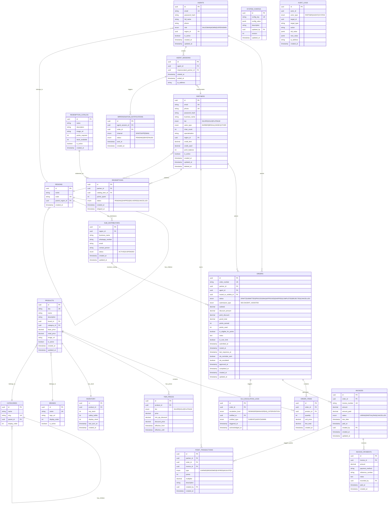

# DATABASE ARCHITECTURE: HIGH-LEVEL ERD
**Project:** PT. Alfa Beauty Cosmetica Digital Hub
**Document Type:** Entity Relationship Diagram & Data Dictionary
**Version:** 2.0
**Prepared by:** Software Architect, DBA, Data Architect
**Approval Required:** CTO & CIO

---

## 1. EXECUTIVE SUMMARY

Dokumen ini mendefinisikan arsitektur database untuk platform B2B PT. Alfa Beauty Cosmetica. Desain mengikuti prinsip:

- **Normalisasi 3NF** untuk integritas data
- **Soft Delete** untuk audit trail
- **DECIMAL** untuk semua nilai moneter (bukan FLOAT)
- **UUID** sebagai Primary Key (untuk distributed system readiness)
- **Timestamp dengan Timezone** untuk operasional multi-region

---

## 2. ENTITY RELATIONSHIP DIAGRAM



---

## 3. DATA DICTIONARY

### 3.1. PARTNERS (Mitra B2B)

| Column | Type | Constraint | Description |
| :--- | :--- | :--- | :--- |
| `id` | UUID | PK | Unique identifier |
| `email` | VARCHAR(255) | UNIQUE, NOT NULL | Login email |
| `phone` | VARCHAR(20) | UNIQUE | WhatsApp number |
| `password_hash` | VARCHAR(255) | NOT NULL | Bcrypt hashed |
| `business_name` | VARCHAR(255) | NOT NULL | Nama Toko/Salon |
| `tier` | ENUM | NOT NULL, DEFAULT 'SILVER' | Tier level |
| `salon_type` | ENUM | NULL | Jenis Salon (Profiling) |
| `chair_count` | INT | NULL | Ukuran bisnis |
| `specialization` | VARCHAR(255) | NULL | Spesialisasi |
| `region_id` | UUID | FK → REGIONS | Region untuk routing |
| `credit_limit` | DECIMAL(15,2) | NOT NULL, DEFAULT 0 | Plafon kredit |
| `credit_used` | DECIMAL(15,2) | NOT NULL, DEFAULT 0 | Kredit terpakai |
| `point_balance` | INT | NOT NULL, DEFAULT 0 | Cached point balance |

### 3.2. SUB_DISTRIBUTORS (Sub-Distributor Wilayah)

| Column | Type | Constraint | Description |
| :--- | :--- | :--- | :--- |
| `id` | UUID | PK | Unique identifier |
| `region_id` | UUID | FK → REGIONS, NOT NULL | Wilayah kerja |
| `business_name` | VARCHAR(255) | NOT NULL | Nama Sub-Distributor |
| `whatsapp_number` | VARCHAR(20) | NOT NULL | WA untuk routing order |
| `email` | VARCHAR(255) | NULL | Email kontak |
| `contact_person` | VARCHAR(255) | NULL | Nama PIC |
| `status` | ENUM | NOT NULL, DEFAULT 'ACTIVE' | ACTIVE, SUSPENDED |

### 3.3. ORDERS (Pesanan)

| Column | Type | Constraint | Description |
| :--- | :--- | :--- | :--- |
| `id` | UUID | PK | Unique identifier |
| `order_number` | VARCHAR(20) | UNIQUE | Human-readable ID |
| `partner_id` | UUID | FK → PARTNERS | Pemesan |
| `agent_id` | UUID | FK → AGENTS, NULL | Jika via Shadow Mode |
| `routed_to_subdist_id` | UUID | FK → SUB_DISTRIBUTORS | Target routing |
| `status` | ENUM | NOT NULL | Lifecycle status |
| `submission_type` | ENUM | NOT NULL | SELF atau AGENT_ASSISTED |
| `is_over_limit` | BOOLEAN | DEFAULT FALSE | Flag over limit |
| `is_eligible_for_points` | BOOLEAN | DEFAULT TRUE | Memenuhi threshold? |
| `points_earned` | INT | DEFAULT 0 | Poin yang akan didapat |
| `points_used` | INT | DEFAULT 0 | Poin yang dipakai |
| `routed_at` | TIMESTAMP | NULL | Waktu di-route ke SubDist |
| `last_response_at` | TIMESTAMP | NULL | Respon terakhir SubDist |
| `sla_reminder_sent` | BOOLEAN | DEFAULT FALSE | Reminder 18 jam sudah kirim? |
| `sla_escalated` | BOOLEAN | DEFAULT FALSE | Sudah eskalasi ke HQ? |

### 3.4. INVOICES (Tagihan)

| Column | Type | Constraint | Description |
| :--- | :--- | :--- | :--- |
| `id` | UUID | PK | Unique identifier |
| `order_id` | UUID | FK → ORDERS, NOT NULL | Order terkait |
| `invoice_number` | VARCHAR(30) | UNIQUE, NOT NULL | Nomor invoice |
| `amount` | DECIMAL(15,2) | NOT NULL | Total tagihan |
| `amount_paid` | DECIMAL(15,2) | DEFAULT 0 | Jumlah sudah dibayar |
| `status` | ENUM | NOT NULL, DEFAULT 'UNPAID' | UNPAID, PARTIAL, PAID, CANCELLED |
| `due_date` | TIMESTAMP | NOT NULL | Jatuh tempo (dari Tier rule) |
| `paid_at` | TIMESTAMP | NULL | Waktu lunas |

**Business Rule:** Poin dari order ini **HANYA CAIR** setelah `status = 'PAID'`.

### 3.5. INVOICE_PAYMENTS (Pembayaran Invoice)

| Column | Type | Constraint | Description |
| :--- | :--- | :--- | :--- |
| `id` | UUID | PK | Unique identifier |
| `invoice_id` | UUID | FK → INVOICES, NOT NULL | Invoice terkait |
| `amount` | DECIMAL(15,2) | NOT NULL | Jumlah pembayaran |
| `payment_method` | VARCHAR(50) | NULL | Transfer, Cash, dll |
| `reference_number` | VARCHAR(100) | NULL | No. bukti transfer |
| `recorded_by` | UUID | FK → AGENTS | Admin yang mencatat |
| `paid_at` | TIMESTAMP | NOT NULL | Waktu pembayaran |

### 3.6. SLA_ESCALATION_LOGS (Log Eskalasi SLA)

| Column | Type | Constraint | Description |
| :--- | :--- | :--- | :--- |
| `id` | UUID | PK | Unique identifier |
| `order_id` | UUID | FK → ORDERS, NOT NULL | Order yang di-eskalasi |
| `escalation_level` | ENUM | NOT NULL | REMINDER (18h), MANAGER, HQ_INTERVENTION (24h) |
| `notified_to` | UUID | NOT NULL | ID penerima notifikasi |
| `notified_type` | ENUM | NOT NULL | SUBDIST, AGENT, ADMIN |
| `triggered_at` | TIMESTAMP | NOT NULL | Waktu eskalasi |
| `acknowledged_at` | TIMESTAMP | NULL | Waktu ditindaklanjuti |

### 3.7. POINT_TRANSACTIONS (Transaksi Poin)

| Column | Type | Constraint | Description |
| :--- | :--- | :--- | :--- |
| `id` | UUID | PK | Unique identifier |
| `partner_id` | UUID | FK → PARTNERS | Pemilik poin |
| `order_id` | UUID | FK → ORDERS, NULL | Order sumber (jika EARNED) |
| `invoice_id` | UUID | FK → INVOICES, NULL | Invoice trigger (wajib untuk EARNED) |
| `type` | ENUM | NOT NULL | EARNED, REDEEMED, EXPIRED, ADJUSTED |
| `points` | INT | NOT NULL | Jumlah poin (+/-) |
| `multiplier` | DECIMAL(10,2) | NULL | Multiplier saat earned |

**Business Rule:** Untuk `type = 'EARNED'`, `invoice_id` wajib diisi dan invoice harus `status = 'PAID'`.

### 3.8. SYSTEM_CONFIGS (Konfigurasi Agile)

| Config Key | Value Type | Example | Description |
| :--- | :--- | :--- | :--- |
| `loyalty.multiplier.silver` | DECIMAL | `1.00` | Point multiplier Silver |
| `loyalty.multiplier.gold` | DECIMAL | `1.20` | Point multiplier Gold |
| `loyalty.multiplier.platinum` | DECIMAL | `1.50` | Point multiplier Platinum |
| `loyalty.expiration_policy` | STRING | `NEVER` | Point expiry policy (NEVER = no expiration) |
| `order.minimum_threshold` | DECIMAL | `500000` | Min order untuk earn poin |
| `stock.sync_interval_minutes` | INT | `15` | Interval sync ERP |
| `sla.reminder_hours` | INT | `18` | Jam ke-X kirim reminder |
| `sla.escalation_hours` | INT | `24` | Jam ke-X eskalasi ke HQ |

> **Note:** `loyalty.expiration_policy = "NEVER"` berdasarkan rekomendasi Annex Cloud untuk B2B (lihat `artifacts/audit_annexcloud_loyalty.md` §9). Enum `EXPIRED` di `POINT_TRANSACTIONS` tetap ada untuk keperluan manual adjustment oleh Admin jika diperlukan di masa depan.

---

## 4. INDEXING STRATEGY

### 4.1. Primary Indexes

| Table | Index | Columns | Type |
| :--- | :--- | :--- | :--- |
| PARTNERS | `idx_partners_email` | `email` | UNIQUE |
| PARTNERS | `idx_partners_tier` | `tier` | B-TREE |
| PARTNERS | `idx_partners_region` | `region_id` | B-TREE |
| ORDERS | `idx_orders_partner` | `partner_id` | B-TREE |
| ORDERS | `idx_orders_status` | `status` | B-TREE |
| ORDERS | `idx_orders_submitted` | `submitted_at` | B-TREE |
| ORDERS | `idx_orders_subdist` | `routed_to_subdist_id` | B-TREE |
| ORDERS | `idx_orders_sla` | `routed_at, sla_reminder_sent` | COMPOSITE |
| INVOICES | `idx_invoices_order` | `order_id` | B-TREE |
| INVOICES | `idx_invoices_status` | `status` | B-TREE |
| INVOICES | `idx_invoices_due` | `due_date` | B-TREE |
| PRODUCTS | `idx_products_sku` | `sku` | UNIQUE |
| PRODUCTS | `idx_products_brand` | `brand_id` | B-TREE |
| AUDIT_LOGS | `idx_audit_actor` | `actor_id, actor_type` | COMPOSITE |
| AUDIT_LOGS | `idx_audit_created` | `created_at` | B-TREE |
| SUB_DISTRIBUTORS | `idx_subdist_region` | `region_id` | B-TREE |
| SLA_ESCALATION_LOGS | `idx_sla_order` | `order_id` | B-TREE |

### 4.2. Partial Indexes (PostgreSQL)

```sql
-- Only index active partners
CREATE INDEX idx_partners_active ON partners(tier) WHERE is_active = true;

-- Only index pending orders
CREATE INDEX idx_orders_pending ON orders(submitted_at) WHERE status = 'SUBMITTED';

-- Orders awaiting SLA reminder (18 hours, not yet sent)
CREATE INDEX idx_orders_sla_pending ON orders(routed_at) 
    WHERE status IN ('SUBMITTED', 'PROCESSING') AND sla_reminder_sent = false;

-- Unpaid invoices approaching due date
CREATE INDEX idx_invoices_unpaid ON invoices(due_date) WHERE status IN ('UNPAID', 'PARTIAL');
```

---

## 5. SECURITY CONSIDERATIONS

### 5.1. Data Classification

| Classification | Tables | Protection |
| :--- | :--- | :--- |
| **PII (High)** | PARTNERS, AGENTS, SUB_DISTRIBUTORS | Encryption at rest, masked in logs |
| **Financial (High)** | ORDERS, INVOICES, INVOICE_PAYMENTS, POINT_TRANSACTIONS | Audit trail mandatory |
| **Operational (Medium)** | PRODUCTS, INVENTORY | Standard protection |
| **Configuration (Low)** | SYSTEM_CONFIGS | Version controlled |

### 5.2. Row-Level Security (RLS)

```sql
-- Partners can only see their own orders
CREATE POLICY partner_orders ON orders
    FOR SELECT
    USING (partner_id = current_user_id());

-- Partners can only see their own invoices
CREATE POLICY partner_invoices ON invoices
    FOR SELECT
    USING (order_id IN (SELECT id FROM orders WHERE partner_id = current_user_id()));

-- Agents can only see orders in their region
CREATE POLICY agent_orders ON orders
    FOR SELECT
    USING (
        partner_id IN (
            SELECT id FROM partners WHERE region_id = current_agent_region()
        )
    );

-- Sub-Distributors can only see orders routed to them
CREATE POLICY subdist_orders ON orders
    FOR SELECT
    USING (routed_to_subdist_id = current_subdist_id());
```

---

## 6. PERFORMANCE CONSIDERATIONS

### 6.1. Read-Heavy Optimization (20:1 Ratio)

| Strategy | Implementation |
| :--- | :--- |
| **Redis Cache** | Products, Tier Prices, System Configs |
| **Denormalized Field** | `partners.point_balance` (updated via trigger) |
| **Materialized View** | Partner statistics (monthly spend, order count) |
| **Read Replica** | Reporting queries |

### 6.2. Point Balance Consistency

```sql
-- Trigger to maintain point_balance on PARTNERS
CREATE OR REPLACE FUNCTION update_partner_point_balance()
RETURNS TRIGGER AS $$
BEGIN
    IF TG_OP = 'INSERT' THEN
        UPDATE partners SET point_balance = point_balance + NEW.points
        WHERE id = NEW.partner_id;
    END IF;
    RETURN NEW;
END;
$$ LANGUAGE plpgsql;

CREATE TRIGGER trg_point_balance
AFTER INSERT ON point_transactions
FOR EACH ROW EXECUTE FUNCTION update_partner_point_balance();
```

### 6.3. Write Optimization

| Strategy | Implementation |
| :--- | :--- |
| **Async Processing** | Point calculations via queue |
| **Batch Inserts** | Audit logs buffered |
| **Connection Pooling** | PgBouncer / Managed DB pooler |

---

## 7. MIGRATION STRATEGY

### 7.1. Phase 1: Core Tables
1. REGIONS, BRANDS, CATEGORIES
2. PRODUCTS, INVENTORY
3. SUB_DISTRIBUTORS
4. PARTNERS
5. AGENTS

### 7.2. Phase 2: Transactional Tables
1. ORDERS
2. ORDER_ITEMS
3. TIER_PRICES
4. INVOICES
5. INVOICE_PAYMENTS

### 7.3. Phase 3: Loyalty & Audit
1. POINT_TRANSACTIONS
2. REDEMPTIONS, REDEMPTION_CATALOG
3. AUDIT_LOGS, AGENT_SESSIONS
4. SLA_ESCALATION_LOGS
5. IMPERSONATION_NOTIFICATIONS
6. SYSTEM_CONFIGS

---

## 8. APPROVAL

Arsitektur database ini memerlukan approval dari:

| Role | Name | Signature | Date |
| :--- | :--- | :--- | :--- |
| **Chief Technology Officer** | ____________ | ____________ | ____________ |
| **Chief Information Officer** | ____________ | ____________ | ____________ |

---

## 9. APPENDIX: ENUM DEFINITIONS

```sql
CREATE TYPE tier_enum AS ENUM ('SILVER', 'GOLD', 'PLATINUM');
CREATE TYPE salon_type_enum AS ENUM ('BARBER', 'BRIDAL', 'UNISEX', 'OTHER');
CREATE TYPE agent_role_enum AS ENUM ('SALESMAN', 'ADMIN', 'SUPERADMIN');
CREATE TYPE subdist_status_enum AS ENUM ('ACTIVE', 'SUSPENDED');
CREATE TYPE order_status_enum AS ENUM ('DRAFT', 'SUBMITTED', 'PROCESSING', 'APPROVED', 'SHIPPED', 'COMPLETED', 'REJECTED', 'CANCELLED');
CREATE TYPE submission_type_enum AS ENUM ('SELF', 'AGENT_ASSISTED');
CREATE TYPE invoice_status_enum AS ENUM ('UNPAID', 'PARTIAL', 'PAID', 'CANCELLED');
CREATE TYPE point_tx_type_enum AS ENUM ('EARNED', 'REDEEMED', 'EXPIRED', 'ADJUSTED');
CREATE TYPE redemption_status_enum AS ENUM ('PENDING', 'SHIPPED', 'DELIVERED', 'CANCELLED');
CREATE TYPE actor_type_enum AS ENUM ('PARTNER', 'AGENT', 'SYSTEM');
CREATE TYPE notification_channel_enum AS ENUM ('WHATSAPP', 'EMAIL');
CREATE TYPE notification_status_enum AS ENUM ('PENDING', 'SENT', 'FAILED');
CREATE TYPE escalation_level_enum AS ENUM ('REMINDER', 'MANAGER', 'HQ_INTERVENTION');
CREATE TYPE notified_type_enum AS ENUM ('SUBDIST', 'AGENT', 'ADMIN');
```
