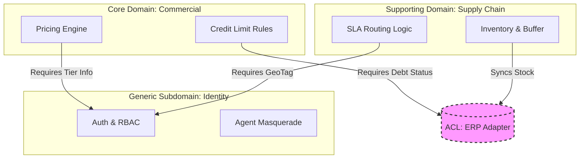

# ENTERPRISE ARCHITECTURE DEFINITION: THE UNIFIED COMMERCE PLATFORM

**Entity:** PT. Alfa Beauty Cosmetica
**Standard:** 2026 Enterprise DevOps Governance
**Target Architecture:** Cloud-Native Modular Monolith (Serverless)
**Version:** 2.4 (Managed DB & Warm-up Pinger)

## 1. CORE ARCHITECTURAL PATTERN: DOMAIN-DRIVEN MODULAR MONOLITH

**Decision Record:** Menolak *Distributed Microservices* demi meminimalkan *Operational Complexity* dan *Network Latency* pada tahap *Growth*.

### 1.1. Domain Boundaries Enforcement & Dependency Graph

*Revisi V2.1: Visualisasi Ketergantungan Modul*

Aplikasi dibangun sebagai satu unit deployable (*Monolith*), namun dengan **Strict Module Isolation**. Aliran data bersifat *Unidirectional* untuk mencegah *Cyclic Dependency*.

### 1.2. Architecture Governance

Mengimplementasikan **ArchUnit** (Java) atau **Dependency Cruiser** (JS/TS) dalam pipeline CI untuk memblokir impor silang yang melanggar grafik di atas.

- *Rule:* `CommercialContext` tidak boleh mengimpor `SupplyChainContext` secara langsung. Komunikasi wajib via *Event Bus* (Internal PubSub).

## 2. INFRASTRUCTURE AS CODE (IaC): IMMUTABLE INFRASTRUCTURE

**Standard:** Terraform (HCL) dengan *Remote State Management*.

### 2.1. Infrastructure Layering

Kami memisahkan *lifecycle* infrastruktur:

- **Layer 0 (Network):** VPC, Subnets, NAT Gateways.
- **Layer 1 (Persistence):** **Managed Database (IDCloudHost/DigitalOcean)** — Self-Managed PostgreSQL **DITOLAK** untuk Production. **Redis Cloud Flex** untuk Cache.
- **Layer 2 (Compute/App):** Cloud Run Service.

## 3. CI/CD PIPELINE: ADVANCED GITOPS WORKFLOW

**Standard:** GitOps Level 4 (Automated Drift Detection).

### 3.1. The "Governance Gauntlet"

Pipeline bertindak sebagai *Quality Gatekeeper*:

1. **Commit Stage:** Linting & Secret Scanning (TruffleHog).
2. **Testing Stage:** Unit Test & Contract Test ([Pact.io](http://Pact.io)).
3. **Business Logic Regression:** Validasi skrip perhitungan Tier Pricing.
4. **Security:** SAST (SonarQube) & Container Scanning (Trivy).

## 4. RUNTIME STRATEGY: SERVERLESS CONTAINERIZATION

**Target:** Google Cloud Run / AWS Fargate.

### 4.1. Concurrency-Based Autoscaling & Cold Start Mitigation

*Revisi V2.1: Realistis terhadap Cold Start*

Klaim "Cold Start < 2s" hanya valid jika kondisi berikut terpenuhi. Jika tidak, latensi bisa mencapai 5-8s.

- **Mitigasi Cold Start (ZERO TOLERANCE POLICY):**
    1. **Min Instances Strategy:** Wajib Set `min-instances = 1` selama jam operasional (07.00 - 19.00). Traffic B2B yang rendah (1.6 tx/menit) membuat container mudah "tertidur", yang berisiko latency tinggi (5-8s) bagi klien VIP.
    2. **Warm-up Pinger:** Implementasi scheduled job (Cloud Scheduler) yang hit `/health` endpoint setiap 5 menit untuk menjaga container tetap warm.
    3. **DB Connection Pooling:** Menggunakan **Cloud SQL Auth Proxy** (GCP) atau **RDS Proxy** (AWS) untuk memelihara *pool* koneksi database yang persisten, sehingga container baru tidak perlu *handshake* SSL berat ke DB saat startup.
    4. **Secret Caching:** Fetching secrets (API Keys) dari Secret Manager dilakukan saat *Build Time* (disuntikkan sebagai Env Vars) atau di-cache di memori, bukan di-fetch saat *Request Time*.

### 4.2. Resilience Patterns

- **Idempotency:** API `POST` wajib menyertakan `Idempotency-Key`.
- **Graceful Shutdown:** Container menangani `SIGTERM` signal.

### 4.3. Config-as-Data Pattern (Agile Deployment)

*Revisi V2.3: Runtime Configuration Management*

Konfigurasi bisnis **TIDAK BOLEH** di-hardcode. Gunakan pattern berikut:

- **Storage:** Tabel `system_config` di Database + Cache di Redis (TTL: 5 menit).
- **Access:** API `/api/admin/config` untuk CRUD.
- **Invalidation:** Perubahan config langsung purge Redis cache.
- **Audit:** Setiap perubahan config tercatat dengan `updated_by` dan `updated_at`.

**Config yang Wajib Externalize:**
- Loyalty Multiplier (per Tier)
- Minimum Order Threshold
- Stock Sync Interval

## 5. OBSERVABILITY: FULL-STACK TELEMETRY (MELT)

**Standard:** OpenTelemetry (OTel).

### 5.1. Distributed Tracing

Setiap request diberi `Trace-ID`.

- **Value:** Deteksi *bottleneck* (misal: Query ke ERP lambat).

### 5.2. Business-Level Monitoring

Dashboard Grafana menampilkan:

- `lead_routing_latency_ms`: Durasi routing order.
- `erp_sync_error_rate`: Kegagalan sync stok.
- `credit_check_rejection_count`: Order tertahan limit.

### 5.3. Investment Focus Mandate (CIO Directive)

**Paradigm:** Cost Optimization adalah prioritas kedua setelah Reliability. Dengan strategi **Hybrid Provider** (VPS Lokal + Managed Redis), biaya infrastruktur dapat ditekan hingga **Rp 300.000/bulan** (~$19) tanpa mengorbankan performa.

- **Strategy:** Gunakan provider lokal (IDCloudHost/Biznet Gio) untuk Compute, Redis Cloud Flex untuk Cache.
- **Investment Focus:** Alokasikan penghematan untuk **Observability & Alerting**.
- **KPI Utama:** Bukan "Berapa murah servernya", tapi "Berapa CEPAT kita tahu jika ada partner gagal order?"
- **Target:** Alert diterima < 5 menit setelah incident.
- **Reference:** Lihat `docs-paket-b/rab_infrastruktur.md` untuk detail perbandingan provider.

## 6. INTEGRATION PATTERNS: RESILIENCE ENGINEERING

### 6.1. The "Anti-Corruption Layer" (ACL)

Integrasi ke Legacy ERP dilakukan melalui ACL Pattern + Circuit Breaker (Resilience4j).

- *Logic:* Jika ERP mati, *fallback* ke cache lokal.

### 6.2. Traffic Shaping for Legacy ERP (CTO Directive)

Traffic web mungkin kecil, namun "burst" mendadak (misal: flash sale reseller) bisa melumpuhkan ERP lama.

- **Pattern:** Asynchronous Queueing.
- **Implementation:**
    1. Web App menerima order (Write to DB immediately).
    2. Background Worker mengirim ke ERP satu per satu (Throttling).
- **Rule:** Jangan pernah *Direct Synchronous Call* ke ERP saat checkout.

## 7. SECURITY ARCHITECTURE: ZERO TRUST

- **Identity-Aware Proxy (IAP):** Akses Dashboard Admin tanpa VPN.
- **Least Privilege:** Service Account dengan izin minimal.

## 8. DEVOPS ROADMAP

- **Phase 1:** Core Engineering (Terraform, Docker).
- **Phase 2:** Governance (Policy, Circuit Breaker).
- **Phase 3:** Intelligence (Observability, Dashboard).