# PT. Alfa Beauty Cosmetica B2B Platform - System Diagrams

**Version:** 2.0
**Date:** January 08, 2026  
**Total Diagrams:** 25

---

## 1. ARCHITECTURE DIAGRAMS

### 1.1 System Context Diagram


### 1.2 Container Diagram


### 1.3 Domain Module Dependencies


### 1.4 Data Flow Architecture


---

## 2. BUSINESS FLOW DIAGRAMS

### 2.1 Order Lifecycle


### 2.2 Credit Check Flow


### 2.3 Invoice & Payment Flow


### 2.4 SLA Escalation Flow


### 2.5 Agent Shadow Mode Flow


### 2.6 Loyalty Points Flow


---

## 3. SEQUENCE DIAGRAMS

### 3.1 Partner Login Sequence


### 3.2 Order Submission Sequence


### 3.3 ERP Stock Sync Sequence


### 3.4 Impersonation Checkout with Notification

```mermaid
sequenceDiagram
    participant AG as Agent
    participant FE as Frontend
    participant API as Backend API
    participant DB as PostgreSQL
    participant AUDIT as Audit Service
    participant NOTIFY as Notification Service
    participant OWNER as Partner Owner
    
    Note over AG,OWNER: Shadow Mode Checkout (FSD §4.2)
    
    AG->>FE: Checkout in Shadow Mode
    FE->>API: POST /orders<br/>Header: x-agent-id: {agent_id}
    
    API->>API: Detect Shadow Mode from header
    
    API->>DB: Create Order<br/>submitted_by: partner_id<br/>agent_id: agent_id
    DB-->>API: Order created
    
    API->>AUDIT: LogImpersonationAction()
    Note over AUDIT: [AUDIT_IMPERSONATION]<br/>Agent:SALES_001 acted_as Partner:USR_001<br/>action:SUBMIT_ORDER
    AUDIT->>DB: INSERT audit_logs
    
    API->>NOTIFY: SendImpersonationNotification()
    
    alt WA Available
        NOTIFY->>OWNER: 📱 WhatsApp Message
        Note over OWNER: "Halo [Toko], Salesman [X]<br/>membuat order [ID] senilai Rp [Y]"
    else WA Failed
        NOTIFY->>OWNER: 📧 Email Fallback
    end
    
    NOTIFY->>DB: INSERT audit_logs (IMPERSONATION_NOTIFIED)
    
    API-->>FE: 201 Created + wa_deep_link
```



### 3.5 Invoice Payment Recording

```mermaid
sequenceDiagram
    participant AD as Admin
    participant FE as Frontend
    participant API as Backend API
    participant DB as PostgreSQL
    participant LOYALTY as Loyalty Service
    participant PARTNER as Partner
    
    AD->>FE: Record payment for Invoice
    FE->>API: POST /invoices/{id}/payments<br/>{amount, method, reference}
    
    API->>DB: Get Invoice with existing payments
    DB-->>API: Invoice + Payments[]
    
    API->>DB: INSERT payment record
    
    API->>API: Calculate total_paid
    
    alt total_paid >= invoice.amount
        API->>DB: UPDATE invoice<br/>status=PAID, paid_at=NOW()
        
        Note over API,LOYALTY: Trigger Point Award
        API->>LOYALTY: AwardPoints(order_id)
        
        LOYALTY->>DB: Get Order.points_earned
        DB-->>LOYALTY: 100 points
        
        LOYALTY->>DB: UPDATE partners<br/>point_balance += 100
        
        LOYALTY->>DB: INSERT point_transactions<br/>type=EARNED, amount=100
        
        LOYALTY-->>PARTNER: 📱 "100 poin sudah ditambahkan!"
        
    else total_paid < invoice.amount
        API->>DB: UPDATE invoice status=PARTIAL
    end
    
    API-->>FE: 200 OK + updated invoice
```



---

## 4. ENTITY RELATIONSHIP DIAGRAMS

### 4.1 Core Business ERD


### 4.2 Catalog ERD


### 4.3 Loyalty ERD


### 4.4 Agent & Audit ERD


---

## 5. STATE DIAGRAMS

### 5.1 Order Status State Machine


### 5.2 Invoice Status State Machine


```mermaid
stateDiagram-v2
    [*] --> UNPAID: Invoice created
    note right of UNPAID
        Trigger: Order.status = APPROVED
        Actions:
        - Calculate due_date by tier
        - Generate invoice_number
    end note
    
    UNPAID --> PARTIAL: Partial payment
    note right of PARTIAL
        Guards:
        - payment.amount < remaining
        Actions:
        - Record payment
        - Update amount_paid
    end note
    
    UNPAID --> PAID: Full payment
    note right of PAID
        Guards:
        - total_paid >= amount
        Actions:
        - Set paid_at
        - Award points to partner
    end note
    
    PARTIAL --> PARTIAL: Another partial
    
    PARTIAL --> PAID: Final payment
    
    UNPAID --> CANCELLED: Cancel invoice
    
    UNPAID --> OVERDUE: Past due_date
    note right of OVERDUE
        Trigger: Scheduled job
        Actions:
        - Flag overdue
        - Notify partner
    end note
    
    OVERDUE --> PAID: Late payment
    
    PAID --> [*]
    CANCELLED --> [*]
```

### 5.3 Partner Tier State Machine

```mermaid
stateDiagram-v2
    [*] --> SILVER: New registration
    note right of SILVER
        Default tier
        Payment: CBD (Cash Before Delivery)
        Point multiplier: 1.0x
    end note
    
    SILVER --> GOLD: Upgrade criteria met
    note right of GOLD
        Criteria:
        - 6 months active
        - Total order > Rp 50M
        - No overdue > 30 days
        
        Payment: NET-14
        Point multiplier: 1.2x
    end note
    
    GOLD --> PLATINUM: Premium criteria met
    note right of PLATINUM
        Criteria:
        - 12 months active
        - Total order > Rp 200M
        - Payment history excellent
        
        Payment: NET-30
        Point multiplier: 1.5x
    end note
    
    GOLD --> SILVER: Downgrade
    note left of SILVER
        Trigger:
        - Overdue > 60 days
        - Inactive > 6 months
    end note
    
    PLATINUM --> GOLD: Downgrade
    
    PLATINUM --> SUSPENDED: Serious violation
    GOLD --> SUSPENDED: Serious violation
    SILVER --> SUSPENDED: Serious violation
    
    SUSPENDED --> SILVER: Re-activated
    
    note right of SUSPENDED
        Trigger:
        - Fraud detected
        - Unpaid > 90 days
        Actions:
        - Block orders
        - Notify sales
    end note
```

---

## 6. COMPONENT DIAGRAMS

### 6.1 Service Layer Architecture

```mermaid
classDiagram
    class AuthService {
        -partnerRepo PartnerRepository
        -jwtService JWTService
        +Login(req) TokenPair
        +Register(req) Partner
        +RefreshTokens(token) TokenPair
    }
    
    class AgentAuthService {
        -agentRepo AgentRepository
        -partnerRepo PartnerRepository
        -jwtService JWTService
        +Login(req) AgentLoginResponse
        +StartImpersonation(req) SessionResponse
        +EndImpersonation(sessionId)
    }
    
    class OrderService {
        -orderRepo OrderRepository
        -partnerRepo PartnerRepository
        -productRepo ProductRepository
        -subdistRepo SubDistRepository
        -configRepo ConfigRepository
        -auditService AuditNotifier
        -invoiceCreator InvoiceCreator
        +CreateOrder(req) Order
        +UpdateOrderStatus(id, status)
        +ApplyVolumeDiscount(items) float64
    }
    
    class InvoiceService {
        -invoiceRepo InvoiceRepository
        -partnerRepo PartnerRepository
        -loyaltyAwarder LoyaltyAwarder
        +CreateFromOrder(order) Invoice
        +RecordPayment(invoiceId, payment)
        +GetByPartner(partnerId) []Invoice
    }
    
    class LoyaltyService {
        -loyaltyRepo LoyaltyRepository
        -partnerRepo PartnerRepository
        +GetPointSummary(partnerId) Summary
        +AwardPoints(orderId)
        +CreateRedemption(req) Redemption
    }
    
    class CreditService {
        -partnerRepo PartnerRepository
        +Check(req) CheckResult
    }
    
    class ConfigService {
        -configRepo ConfigRepository
        -auditLogger AuditLogger
        +GetAllConfigs() []Config
        +SetConfig(key, value)
    }
    
    class SLAService {
        -db Database
        -config SLAConfig
        +Start()
        +Stop()
        +CheckPendingOrders()
        +SendReminder(orderId)
        +Escalate(orderId)
    }
    
    AuthService --> PartnerRepository
    AgentAuthService --> AgentRepository
    AgentAuthService --> PartnerRepository
    OrderService --> OrderRepository
    OrderService --> SubDistRepository
    OrderService ..> InvoiceService : creates invoice
    InvoiceService --> InvoiceRepository
    InvoiceService ..> LoyaltyService : awards points
    LoyaltyService --> LoyaltyRepository
    ConfigService --> ConfigRepository
```

### 6.2 Repository Pattern

```mermaid
classDiagram
    class PartnerRepository {
        <<interface>>
        +GetByID(id) Partner
        +GetByEmail(email) Partner
        +Create(partner) error
        +Update(partner) error
        +Delete(id) error
        +List(opts) []Partner, int64
        +UpdateCredit(id, amount) error
        +UpdatePoints(id, points) error
    }
    
    class PostgresPartnerRepository {
        -db *gorm.DB
        +GetByID(id) Partner
        +GetByEmail(email) Partner
        +Create(partner) error
        +Update(partner) error
        +Delete(id) error
        +List(opts) []Partner, int64
        +UpdateCredit(id, amount) error
        +UpdatePoints(id, points) error
    }
    
    class OrderRepository {
        <<interface>>
        +GetByID(id) Order
        +GetByOrderNumber(num) Order
        +Create(order) error
        +Update(order) error
        +UpdateStatus(id, status) error
        +List(opts) []Order, int64
        +ListByPartner(partnerId, opts) []Order, int64
    }
    
    class PostgresOrderRepository {
        -db *gorm.DB
        +GetByID(id) Order
        +GetByOrderNumber(num) Order
        +Create(order) error
        +Update(order) error
        +UpdateStatus(id, status) error
        +List(opts) []Order, int64
        +ListByPartner(partnerId, opts) []Order, int64
    }
    
    PartnerRepository <|.. PostgresPartnerRepository : implements
    OrderRepository <|.. PostgresOrderRepository : implements
    
    note for PartnerRepository "Domain interface\n(internal/domain/partner)"
    note for PostgresPartnerRepository "Implementation\n(internal/repository/postgres)"
```

### 6.3 Handler-Service-Repository Stack

```mermaid
flowchart TB
    subgraph "Presentation Layer"
        H1[AuthHandler]
        H2[OrderHandler]
        H3[InvoiceHandler]
        H4[LoyaltyHandler]
        H5[ConfigHandler]
    end
    
    subgraph "Application Layer (Services)"
        S1[AuthService]
        S2[OrderService]
        S3[InvoiceService]
        S4[LoyaltyService]
        S5[ConfigService]
        S6[AuditService]
        S7[SLAService]
    end
    
    subgraph "Domain Layer (Entities & Interfaces)"
        D1[Partner Entity]
        D2[Order Entity]
        D3[Invoice Entity]
        D4[Loyalty Entities]
        D5[Config Entity]
        R1[PartnerRepository Interface]
        R2[OrderRepository Interface]
        R3[InvoiceRepository Interface]
        R4[LoyaltyRepository Interface]
        R5[ConfigRepository Interface]
    end
    
    subgraph "Infrastructure Layer"
        PG[(PostgreSQL)]
        RD[(Redis)]
        ERP[ERP Adapter]
    end
    
    H1 --> S1
    H2 --> S2
    H3 --> S3
    H4 --> S4
    H5 --> S5
    
    S1 --> R1
    S2 --> R2
    S2 -.-> S6
    S3 --> R3
    S3 -.-> S4
    S4 --> R4
    S5 --> R5
    S5 -.-> S6
    S7 --> R2
    
    R1 --> PG
    R2 --> PG
    R3 --> PG
    R4 --> PG
    R5 --> PG
    
    S2 -.-> RD
    ERP -.-> RD
    
    style H1 fill:#E8F5E9
    style H2 fill:#E8F5E9
    style H3 fill:#E8F5E9
    style H4 fill:#E8F5E9
    style H5 fill:#E8F5E9
    style S1 fill:#E3F2FD
    style S2 fill:#E3F2FD
    style S3 fill:#E3F2FD
    style S4 fill:#E3F2FD
    style S5 fill:#E3F2FD
    style S6 fill:#E3F2FD
    style S7 fill:#E3F2FD
```

---

## Summary

| Category | Count | Purpose |
|----------|-------|---------|
| Architecture | 4 | System structure & boundaries |
| Business Flows | 6 | Core business processes |
| Sequences | 5 | Detailed interaction flows |
| ERD | 4 | Database relationships |
| State Machines | 3 | Status transitions |
| Components | 3 | Code architecture |
| **TOTAL** | **25** | Complete system documentation |

---

*Generated by CTO/CIO Analysis*  
*PT. Alfa Beauty Cosmetica B2B Platform*
