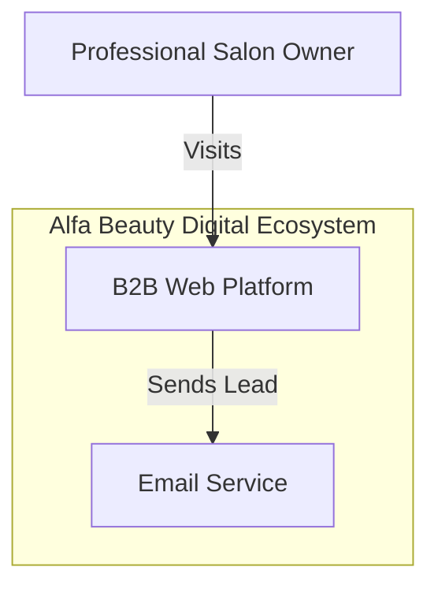
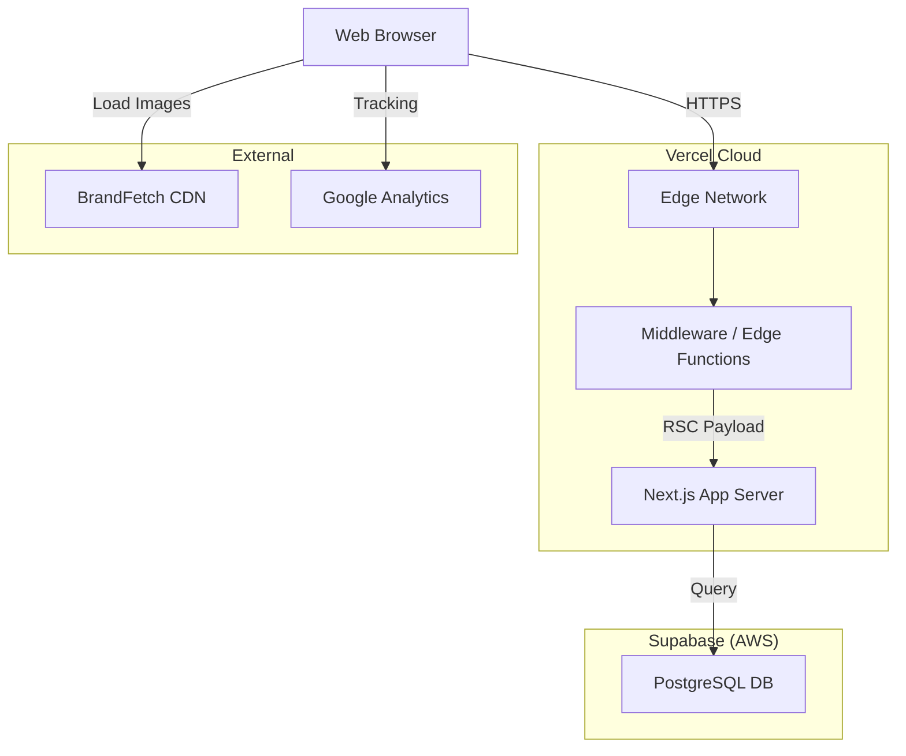

# Architecture Specification (TOGAF)

**Framework**: TOGAF 10 (Enterprise Architecture)
**Scope**: Technical Implementation of Alfa Beauty B2B.

---

## 1. Executive Summary

This architecture adheres to the **Jamstack 2.0** methodology, emphasizing Decoupled Frontend/Backend, High Availability, and Operational Simplicity.

- **Frontend**: Next.js 16 (App Router, RSC).
- **Backend**: Supabase (PostgreSQL 15, Auth).
- **Edge**: Vercel (CDN, Middleware).
- **Compliance**: ITIL 4 (Resilience), COBIT (Governance).

---

## 2. Infrastructure & Operations

### Deployment Tactics

| Component | Technology | Strategy |
| :--- | :--- | :--- |
| **Compute** | Serverless / Edge | "Scale to Zero" cost model. |
| **Database** | PostgreSQL | Managed via Supabase. |
| **Secrets** | Vercel Env Vars | Encrypted. Rotated quarterly. |
| **Monitoring** | Sentry + Vercel | Full Observability (Errors + Vitals). |

### Rate Limiting (Resiliency)

- **Mechanism**: Distributed Token Bucket via Upstash Redis (memory fallback).
- **Limit**: ~5 requests/hour per IP for Lead Submission.
- **Status**: ✅ Implemented (OWASP API4:2023 compliant).

---

## 3. Technology Radar (Lifecycle)

| Ring | Technologies |
| :--- | :--- |
| **ADOPT** | Next.js 16, Supabase, Tailwind v4, Vitest, Playwright. |
| **TRIAL** | React Server Actions (for complex mutations). |
| **HOLD** | Jest (Legacy), Redux (Overkill). |

---

## 4. Visual Architecture (C4 Model)

### Context Diagram

### Container Diagram

---

## 5. Strategic Alignment

This architecture is governed by the [2026 Strategic Framework](../../../docs/strategy-2026.md), aligning with the **Three Pillars** strategy:

- **Jamstack 2.0**: For Performance and Operational Efficiency (Architecture).
- **ITIL 4 Lite**: For Service Level Management (Availability).
- **Scrum**: For iterative feature delivery.
- **COBIT 2019**: For Governance and Data Protection (UU PDP).

---

**Version**: 2.1 | **Last Updated**: 2026-02-04 | **Owner**: CTO
