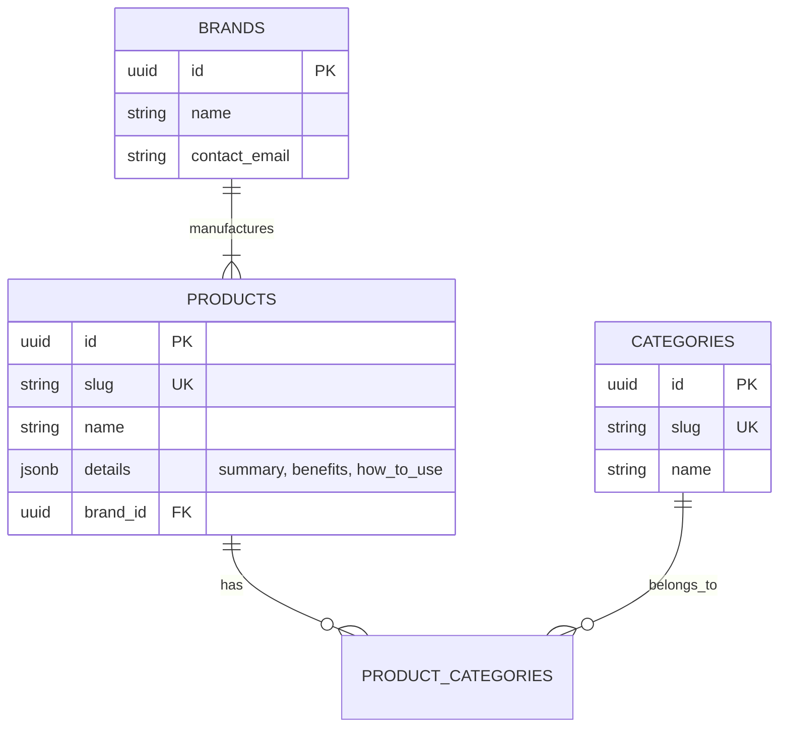

# Schema Evolution Plan: Product Catalog

**Status**: Draft (Phase 1 verified)
**Target**: Phase 2 (Q3 2026)
**Owner**: Information Architect

## 1. Current State (Phase 1: Static JSON)

* **Source**: `src/content/products.json`
* **Pros**: Zero latency (in-memory), Git versioned, simple to edit.
* **Cons**: No inventory, harder to filter dynamically, limited relationships.

```typescript
type Product = {
  slug: string;
  name: string;
  brand: string; // "Brand A"
  categories: string[]; // ["shampoo"]
  // ...
}
```

## 2. Target State (Phase 2: Supabase Relational)

We will migrate to a **Third Normal Form (3NF)** schema to support inventory and dynamic relationships.

### ER Diagram



### Table Definitions

1. **`brands`**: Normalizes `brand` string. Allows managing supplier contacts.
2. **`categories`**: Normalizes `categories` array. Allows hierarchy (Parent ID for Sub-categories).
3. **`products`**: Core entity.
    * `functions` and `benefits` can remain `jsonb` initially for flexibility, or `text[]` (Postgres Array).

## 3. Migration Strategy (The "Strangler Fig" Pattern)

We will not switch overnight. We will use a **Hybrid Approach**.

### Step 1: Database Hydration (Seed Script)

Create a script `scripts/migrate-products.ts` that:

1. Reads `products.json`.
2. Upserts `Brands` (Deduplicated).
3. Upserts `Categories` (Deduplicated).
4. Inserts `Products`.

### Step 2: Parallel Fetching

Update `src/lib/catalog.ts` to:

* Fetch from JSON (Master).
* Fetch from Supabase (Shadow).
* Log discrepancies to Sentry (Validation).

### Step 3: Switchover

* Change `catalog.ts` to use Supabase as Master.
* Retain JSON as fallback (Offline Mode).

## 4. Governance (TOGAF)

* **Constraint**: All Schema changes must be versioned via Supabase Migrations (`supabase db diff`).
* **Safety**: No breaking changes to `slug` without 301 Redirect plan.
