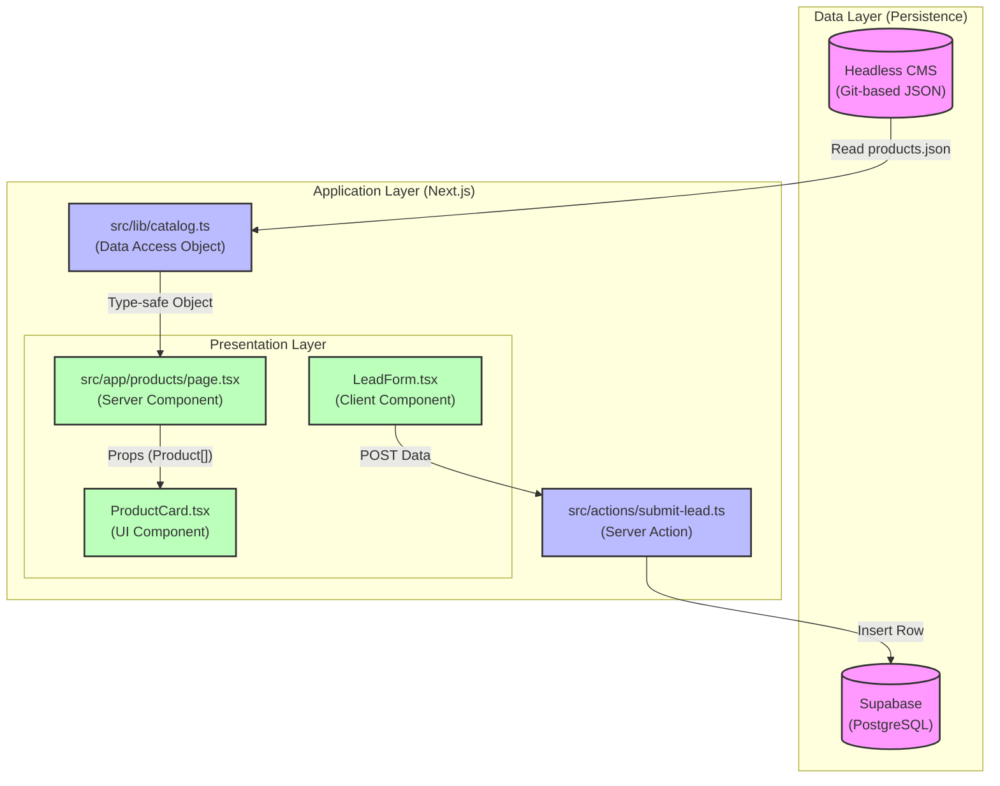

# Strategic Framework Implementation (2026 Vision)

Implementasi keempat framework (ITIL 4, COBIT, TOGAF, dan Jamstack/DevOps) pada proyek **PT. Alfa Beauty Cosmetica** disesuaikan dengan skala operasional B2B untuk efisiensi maksimal tanpa *over-engineering*.

Berikut adalah analisis ketepatan implementasi untuk masing-masing framework pada tech stack (Next.js 16 + Supabase + Vercel) di tahun 2026:

## 1. ITIL 4 (Manajemen Layanan B2B)

**Status: Sangat Tepat.**
Karena ini adalah platform B2B, ketersediaan (*availability*) adalah segalanya bagi klien bisnis.

* **Penerapan:** Gunakan praktik **Service Level Management** untuk memastikan website selalu dapat diakses saat klien ingin melakukan input lead. Karena menggunakan *Vercel Free*, ITIL membantu menyusun rencana cadangan jika terjadi limitasi trafik.
* **Aksi:** Tetapkan prosedur "Incident Management" jika API Supabase atau Headless CMS mengalami gangguan.

## 2. COBIT 2019 (Tata Kelola Data & Kepatuhan)

**Status: Sangat Tepat (Kritis untuk B2B).**
Platform B2B mengumpulkan data bisnis (Lead Capture). Di tahun 2026, regulasi perlindungan data (seperti UU PDP di Indonesia) sangat ketat.

* **Penerapan:** Gunakan COBIT untuk memastikan alur data dari **Next.js** ke **Supabase** terlindungi secara hukum. COBIT membantu mengatur siapa yang memiliki akses ke data lead di dashboard Supabase.
* **Aksi:** Audit secara berkala akses pengguna pada akun Vercel dan Supabase.

## 3. TOGAF (Arsitektur Terintegrasi)

**Status: Tepat (Fokus pada Integrasi).**
Proyek melibatkan banyak komponen terpisah: Next.js (Frontend), Supabase (Database), dan Headless CMS.

* **Penerapan:** TOGAF memastikan bahwa integrasi antara **Headless CMS** dan **Next.js 16.x** tetap terstruktur saat produk kosmetik bertambah banyak. Mendefinisikan standar struktur data produk agar konsisten.
* **Aksi:** Buat diagram "Information Systems Architecture" yang memetakan aliran data dari CMS ke tampilan katalog produk.

## 4. Jamstack/DevOps (Efisiensi Teknis)

**Status: Sangat Tepat (Wajib).**
Tech stack (Next.js + Vercel + Headless CMS) adalah perwujudan modern dari Jamstack.

* **Penerapan:** Memastikan proses pengembangan berjalan otomatis. Setiap perubahan deskripsi produk di CMS harus memicu *re-build* atau menggunakan **Incremental Static Regeneration (ISR)** di Next.js.
* **Aksi:** Optimalkan penggunaan Vercel Deployment Pipelines agar setiap perubahan kode diuji secara otomatis sebelum *live*.

---

## Tiga Pilar Utama (Strategi 2026)

Untuk proyek **PT. Alfa Beauty Cosmetica** dengan skala B2B Platform, framework yang **paling tepat dan tidak berlebihan** untuk diterapkan adalah kombinasi dari tiga pilar berikut:

### 1. Agile Framework: SCRUM (Metodologi Pengembangan)

Mengingat kebutuhan fitur B2B yang terus berkembang (katalog, skema lead).

* **Alasan:** Rilis fitur bertahap (sprint). Meluncurkan *Landing Page* terlebih dahulu, kemudian *Lead Capture*.
* **Penerapan:** Gunakan tools (Linear/Trello) untuk backlog fitur Next.js.

### 2. Technical Framework: JAMSTACK 2.0 (Arsitektur Web)

Framework arsitektur paling tepat untuk visual tinggi namun ringan.

* **Alasan:** Decoupling *Frontend* (Next.js), *Database* (Supabase), dan *Content* (Headless CMS) mencegah "total downtime".
* **Manfaat:** Kecepatan akses luar biasa (LCP tinggi) untuk citra brand premium.

### 3. Service Framework: ITIL 4 (Fokus "Change Management")

Cukup ambil bagian **Change Management** dan **Incident Management**.

* **Alasan:** Down-time pada form *Lead Capture* dapat menghilangkan klien besar.
* **Penerapan:** Setiap perubahan kode (update library dll) wajib diuji di *Preview Deployment* Vercel sebelum merge ke *Main Branch*. Gunakan Sentry untuk monitoring real-time.

---

## Strategi Implementasi Paling Tepat (2026)

| Kategori | Framework Pilihan | Alasan Untuk Alfa Beauty |
| :--- | :--- | :--- |
| **Manajemen Proyek** | **Scrum** | Respon cepat terhadap tren pasar kosmetik. |
| **Arsitektur** | **Jamstack** | Keamanan tinggi dan akses cepat dari mobile. |
| **Operasional** | **DevOps** | Automasi integrasi Next.js & Supabase untuk integritas data. |
| **Keamanan** | **ISO 27001 (Lite)** | Melindungi data mitra bisnis di Supabase agar tidak bocor. |

**Rekomendasi Utama:** Fokus pada **DevOps + Jamstack** dengan Vercel (Deployment) dan Supabase (Data) sebagai core operational tools.

## Lampiran: TOGAF Information Systems Architecture Implementation

This diagram maps the data flow within the architecture, specifically focusing on the Product Catalog (CMS Flow) and Lead Generation (Transactional Flow).

### Data Flow Diagram (Mermaid)

### Component Description

#### 1. Catalog System (Read-Heavy)

* **Source**: `src/content/products.json` serves as the Single Source of Truth for product data.
* **Access**: `src/lib/catalog.ts` provides typed functions (`listProducts`, `getProductBySlug`) to access this data.
* **Rendering**: Next.js Server Components consume these functions at build time (SSG) or request time (SSR), passing data to UI components.

#### 2. Lead Capture System (Write-Heavy)

* **Source**: User input via `LeadForm.tsx`.
* **Processing**: `submit-lead.ts` validates input (Zod), sanitizes data, and handles retry logic.
* **Storage**: Validated data is securely stored in Supabase `leads` table via the `supabase-js` Admin client.
