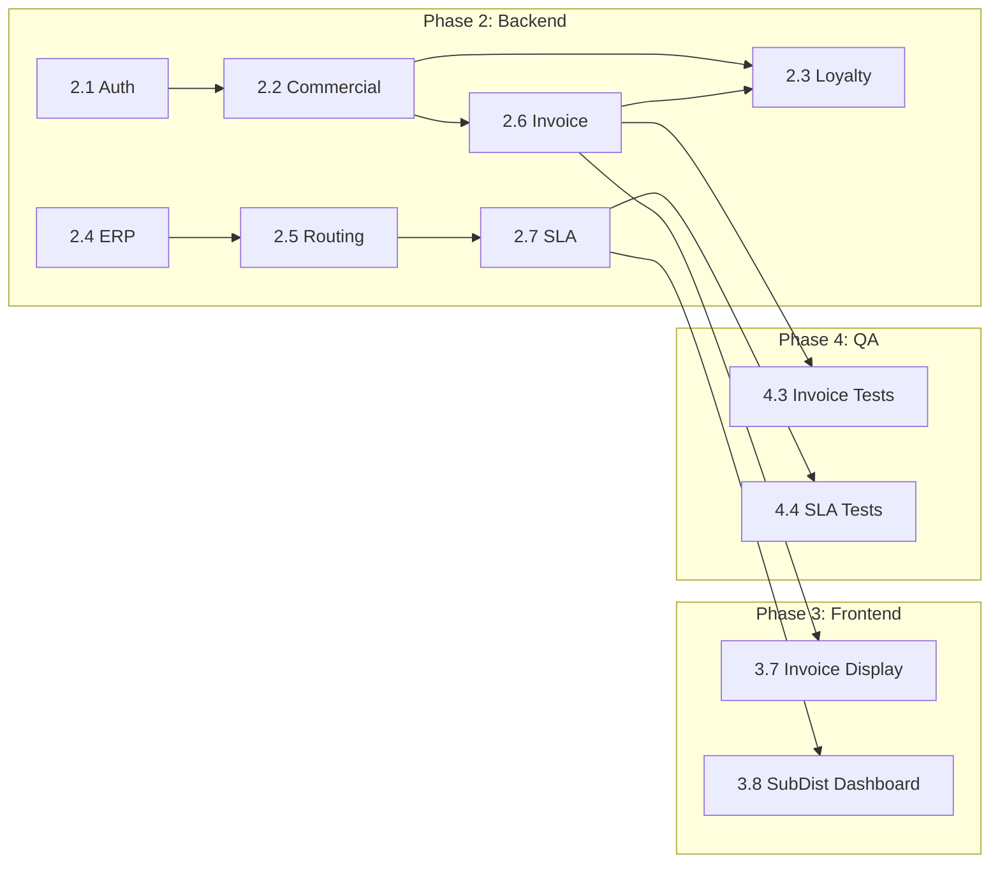

# IMPLEMENTATION STRATEGY & WORK BREAKDOWN STRUCTURE (WBS)

**Project:** PT. Alfa Beauty Cosmetica Digital Hub
**Document Type:** Execution Roadmap & WBS
**Methodology:** Hybrid Agile
**Version:** 2.5

## 1. EXECUTIVE SUMMARY

Strategi "Backend-First, Integration-Heavy" tetap menjadi andalan. Kita memprioritaskan saluran data (ERP/WA) sebelum UI.

## 2. TEAM COMPOSITION

- Solutions Architect (Lead)
- Backend Engineer (Go/Node)
- Frontend Engineer (React)
- DevOps Engineer
- QA Engineer

## 3. MASTER TIMELINE

- **Phase 1:** Infra & Sprint Zero.
- **Phase 2:** Core Backend (Auth, Commercial, Loyalty, Invoice).
- **Phase 3:** Frontend & Experience.
- **Phase 4:** Hardening & UAT.

## 4. DETAILED WORK BREAKDOWN STRUCTURE (WBS)

Estimasi dalam **Man-Days (MD)**.

### EPICS 1: INFRASTRUCTURE & DEVOPS (Total: 14 MD)

- 1.1 Cloud Provisioning (Terraform). (4 MD)
- 1.2 CI/CD & Governance (ArchUnit, SonarQube). (5 MD)
- 1.3 Observability (OTel, Grafana). (3 MD)
- 1.4 Redis & Cold Start Tuning (Min-Instances Config). (2 MD)

### EPICS 2: BACKEND CORE SERVICES (Total: 60.5 MD)

- **2.1 Auth & Identity Module**
    - JWT, RBAC Middleware. (5 MD)
- **2.2 Commercial Module (The Brain)**
    - Credit Limit Heuristics. (4 MD)
    - Tier-based Pricing Engine. (5 MD)
- **2.3 Loyalty & Rewards Engine**
    - **Logic:** Multiplier Point Calculation (Base x Multiplier). (3 MD)
    - **Logic:** Invoice Payment Listener (Trigger point cair saat lunas). (2 MD)
    - **Logic:** Fixed Redemption Catalog API. (2 MD)
- **2.4 Integration: Legacy ERP**
    - ACL Adapter, Stok Sync, Credit Handshake. (11 MD)
    - **Resilience:** Circuit Breaker & Degraded Mode Logic. (3 MD)
    - **Buffer Client IT:** Antisipasi delay firewall/API dari tim internal. (3 MD)
- **2.5 Integration: WhatsApp & Routing**
    - SLA Routing Algo, WA Payload, Latency Tracker. (10 MD)
    - SubDistributor Lookup: Region → SubDist mapping, fallback logic. (1 MD)
- **2.6 Invoice Module**
    - Schema: INVOICES, INVOICE_PAYMENTS tables. (0.5 MD)
    - API: Create invoice on APPROVED, record payments. (1.5 MD)
    - Logic: Auto-calculate due_date from Tier rule. (0.5 MD)
    - Trigger: Point credit on Invoice PAID. (0.5 MD)
- **2.7 SLA Escalation Module**
    - Schema: SLA_ESCALATION_LOGS table. (0.25 MD)
    - Scheduled Job: Check pending orders every 15 min. (0.5 MD)
    - Notification: Send reminder (18h), escalation (24h). (0.75 MD)

### EPICS 3: FRONTEND EXPERIENCE (Total: 41 MD)

- **3.1 Component Library** (Tailwind/Chakra). (7 MD)
- **3.2 Logic Components** (DynamicButton, AgentManager). (6 MD)
- **3.3 Public Pages** (Catalog, Deep-link). (7 MD)
- **3.4 Private Pages** (Inquiry Builder, Dashboard). (13 MD)
- **3.5 Multi-Language (i18n)** (ID/EN). (2 MD)
- **3.6 Admin Panel UI** (Config CRUD). (4 MD)
- **3.7 Invoice Display:** Order history dengan status invoice & poin pending. (1 MD)
- **3.8 SubDist Dashboard:** Queue order, update status. (1 MD)

### EPICS 4: QUALITY ASSURANCE & UAT (Total: 21 MD)

- 4.1 Automated Testing (Unit & E2E). (10 MD)
- 4.2 UAT Support. (5 MD)
- 4.3 Invoice & SLA Test Scenarios. (3 MD)
- 4.4 Routing & Escalation Test Scenarios. (3 MD)

### EPICS 5: AGILE CONFIG & PARTNER PROFILING (Total: 6 MD)

- **5.1 Partner Profiling**
    - Database Schema (salon_type, chair_count, region_id). (0.5 MD)
    - Profile API & Form UI. (2.5 MD)
- **5.2 Admin Config Backend**
    - Config API + Redis Caching. (2.0 MD)
    - SLA Config Keys: `sla.reminder_hours`, `sla.escalation_hours`. (Included)
- **5.3 Testing & Docs**
    - Integration Tests + Doc Updates. (1.0 MD)

## 5. RESOURCE CALCULATION

| Discipline | Est. Total Man-Days |
| --- | --- |
| **DevOps** | 14 MD |
| **Backend** | 60.5 MD |
| **Frontend** | 41 MD |
| **QA/Tester** | 21 MD |
| **PM/Architect** | 20 MD |
| **Partner Profiling** | 6 MD |
| **TOTAL** | **162.5 MD** |

**Estimasi durasi kalender: 16 Minggu (4 Bulan).**

## 6. DEPENDENCY GRAPH

**Critical Path:** AUTH → COMMERCIAL → INVOICE → LOYALTY (Point credit depends on Invoice PAID)

## 7. RISK MITIGATION

| Risk | Probability | Impact | Mitigation |
| --- | --- | --- | --- |
| ERP Access Stability | Medium | High | 3 MD buffer dipertahankan |
| WA Pricing Changes | Low | Medium | Fallback to Copy-Paste |
| User Resistance | Medium | Medium | Agent Assist Mode |
| Invoice Logic Complexity | Low | High | Partial payment thoroughly tested |
| SLA Timing Edge Cases | Medium | Medium | Scheduled job dengan tolerance ±5 min |

## 8. NEXT STEP

WBS ini sekarang lengkap dan mencakup seluruh fitur yang dijanjikan di Blueprint:
- ✅ Loyalty Engine dengan Invoice dependency
- ✅ Geo-Routing ke SubDistributor
- ✅ SLA Escalation 18h/24h
- ✅ Point eligibility threshold

Siap untuk eksekusi Phase 1.